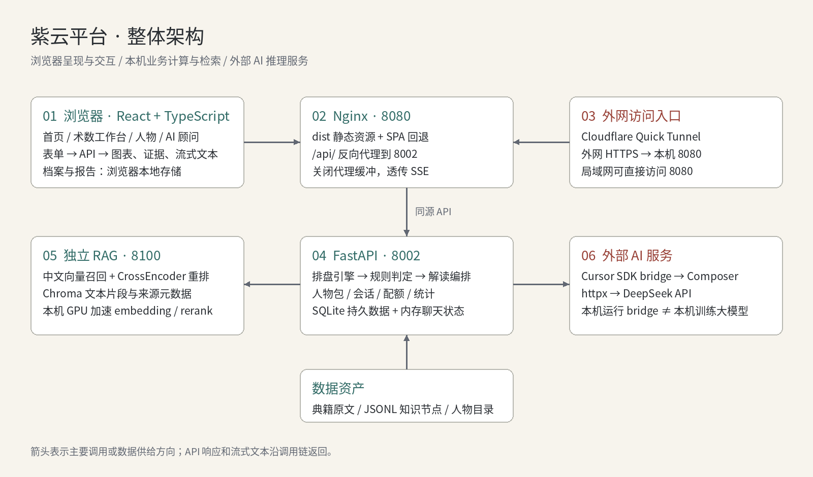

# 紫云命理天文馆

术数排盘与 AI 顾问平台。源码在 `code/`，在线预览和学习文档如下。

## 在线预览

打开对话页：[https://chose-ranch-subsequent-survivors.trycloudflare.com/?page=chat](https://chose-ranch-subsequent-survivors.trycloudflare.com/?page=chat)

访问口令：`4dc150`

进入后如果弹出「输入访问口令」，填上面这组即可。隧道地址可能会随重启变化。

## 项目学习文档

完整指南（架构、源码路径、请求链路、调试方法）：

**[紫云项目学习文档 · 项目架构与源码学习指南](code/docs/紫云项目学习文档/项目架构与源码学习指南.md)**

| 章节 | 内容 |
| --- | --- |
| [1. 项目定位与功能全貌](code/docs/紫云项目学习文档/项目架构与源码学习指南.md#s01) | 产品做什么 |
| [2. 整体架构](code/docs/紫云项目学习文档/项目架构与源码学习指南.md#s02) | 五层如何协作 |
| [3. 技术路线](code/docs/紫云项目学习文档/项目架构与源码学习指南.md#s03) | 选型理由 |
| [4. 目录结构](code/docs/紫云项目学习文档/项目架构与源码学习指南.md#s04) | 源码阅读地图 |
| [5–6. 前端 / 后端](code/docs/紫云项目学习文档/项目架构与源码学习指南.md#s05) | 页面、路由与服务 |
| [7–10. 排盘、判定、知识库、RAG](code/docs/紫云项目学习文档/项目架构与源码学习指南.md#s07) | 计算与证据如何产生 |
| [11–13. AI 对话与名人对话](code/docs/紫云项目学习文档/项目架构与源码学习指南.md#s11) | 模型调用与人物 Skill |
| [16–17. 部署与排错](code/docs/紫云项目学习文档/项目架构与源码学习指南.md#s16) | 本机与内网穿透 |

配图在同目录的 `assets/project-guide/`，阅读指南时请一起打开。

## 仓库说明

- 业务代码：`code/frontend`、`code/backend`
- DeepSeek / Cursor 等密钥只放本机 `code/backend/.env`，不要提交
- 本机环境变量模板：`code/backend/.env.example`
