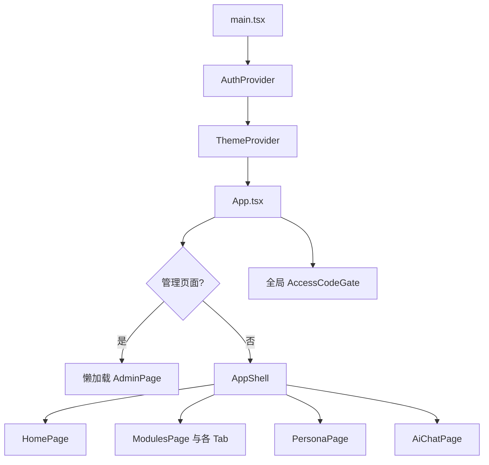
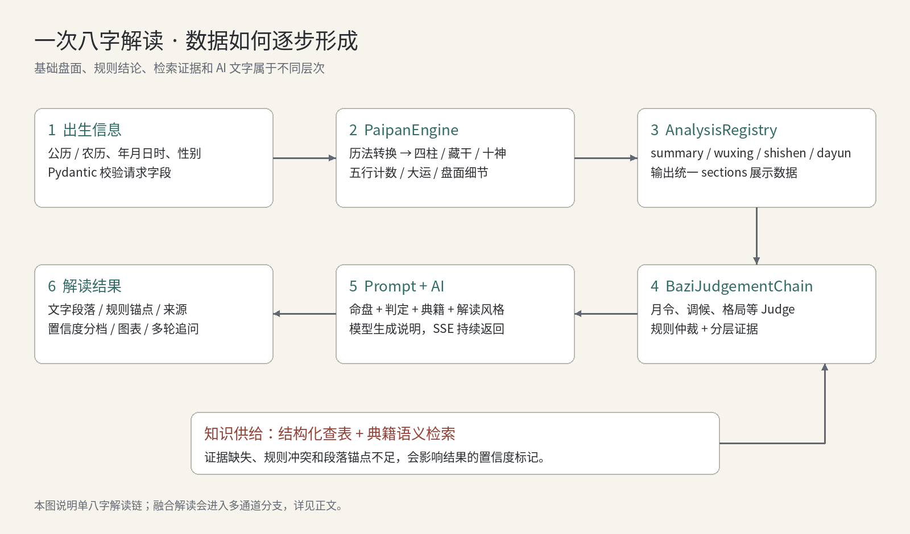
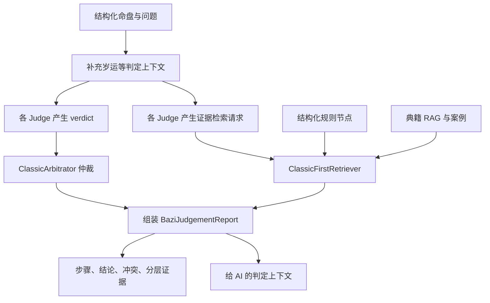
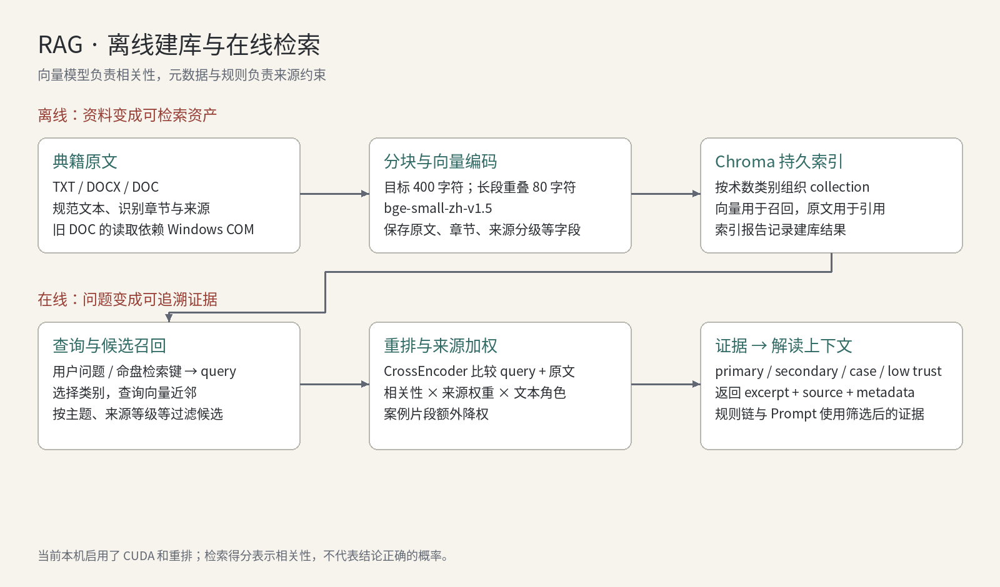
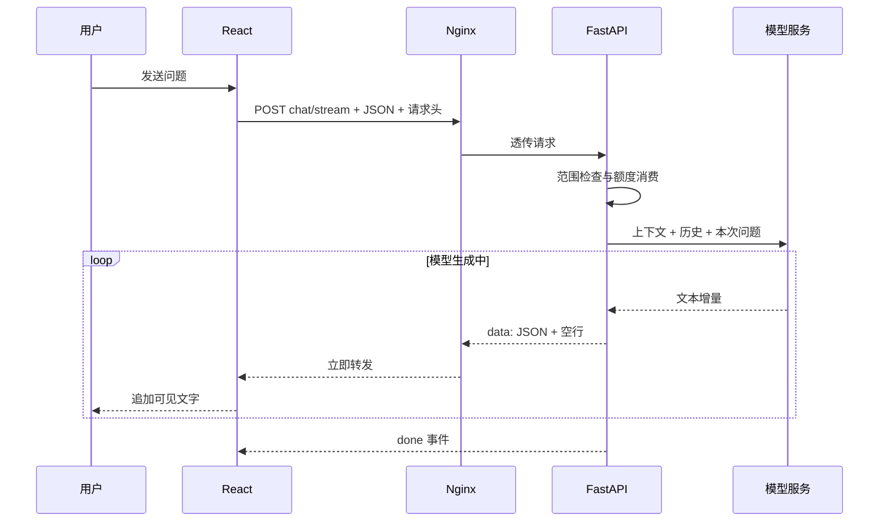
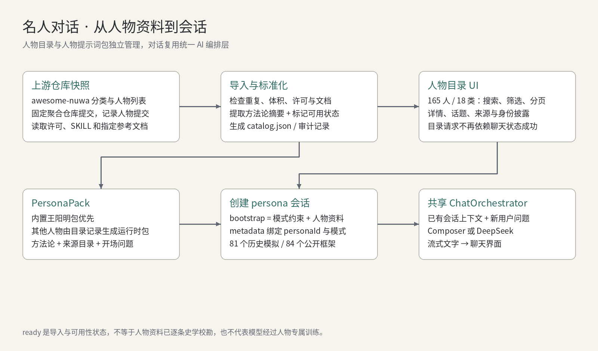
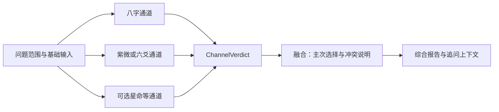
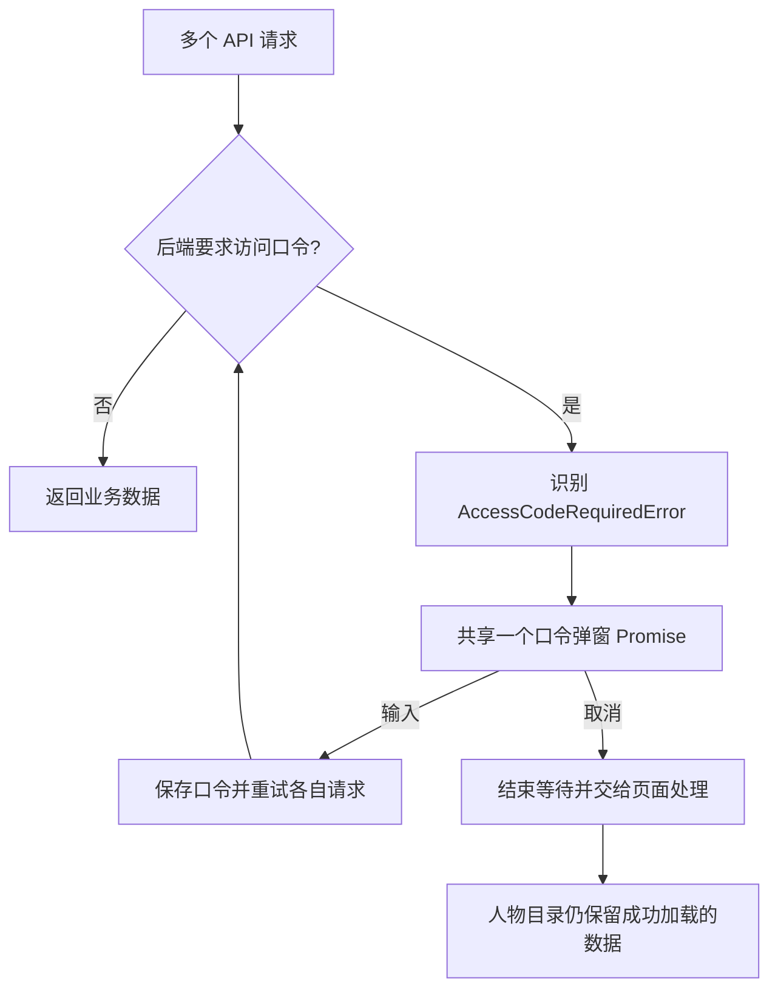

# 紫云命理天文馆：项目架构与源码学习指南

> 代码与本机接口核对日期：2026-09-07。本文以 `/home/feng/liqingfeng/ZY` 当前工作区为依据，包含尚未提交的实现。运行数据是核对时的快照，不代表永久配置。
>
> 阅读目标：理解产品做什么、技术为什么这样选、请求如何穿过各层、结果从哪里来，以及如何自己调试和扩展。
>
> 配图提供普通 Markdown 可显示的 PNG，以及可放大的 SVG。文中的 Mermaid 是补充流程图；阅读器不支持 Mermaid 时，可结合 PNG 和步骤说明阅读。分享时请保留本文同级的 `assets/project-guide/` 目录。
>
> 配套 ZIP 包含本文、配图和绘图源程序。源码链接需在完整项目仓库中打开；文档包本身不包含业务源码。

## 目录

1. [项目定位与功能全貌](#s01)
2. [整体架构：五层如何协作](#s02)
3. [技术路线与选型理由](#s03)
4. [目录结构与源码阅读地图](#s04)
5. [前端实现：页面、状态与可视化](#s05)
6. [后端实现：路由、数据模型与服务](#s06)
7. [八字排盘：确定性计算的完整路径](#s07)
8. [规则判定：Judge、仲裁与证据链](#s08)
9. [结构化知识库：知识如何变成可查规则](#s09)
10. [RAG：典籍如何进入模型上下文](#s10)
11. [AI 解读与多轮对话](#s11)
12. [SSE：文字为什么能逐步出现](#s12)
13. [名人对话：人物 Skill 如何发挥作用](#s13)
14. [多术数融合与一致性评分](#s14)
15. [数据保存、鉴权、额度和并发](#s15)
16. [本机部署与内网穿透](#s16)
17. [接口实验与排错方法](#s17)
18. [测试、评测与质量判断](#s18)
19. [当前边界与后续改进方向](#s19)
20. [循序渐进的学习路线](#s20)
21. [源码索引与术语表](#s21)

<a id="s01"></a>
## 1. 项目定位与功能全貌

这个项目已经从早期的八字排盘 MVP，发展为一个集成多种传统术数、典籍检索、AI 解读和人物思想对话的 Web 平台。页面品牌为“紫云命理天文馆”，主要业务代码位于 `code/`。

它有三类核心工作：

1. **计算与规则分析**：把出生时间、起卦信息、方位等输入，转换成结构化盘面，再按规则生成分析结果。
2. **知识与证据组织**：从结构化知识节点和典籍片段中查找支持材料，保留来源、类别和证据角色。
3. **交互与语言表达**：通过图表、专业盘面、自然语言和多轮问答，把结果呈现给用户；人物对话则使用人物方法论作为对话上下文。

从软件学习角度，它覆盖了一个比较完整的 AI 应用过程：前端交互、后端 API、领域规则、向量检索、提示词编排、流式输出、数据存储和服务部署。

### 1.1 用户能看到的主要功能

| 功能层 | 具体功能 | 实现入口 |
| --- | --- | --- |
| 首页 | 产品介绍、功能入口、使用引导 | `HomePage.tsx`、`components/product/home/` |
| 命盘 | 八字命理、紫微斗数、星命占验 | `BaziTab`、`ZiweiTab`、`XingmingTab` |
| 卜筮 | 六爻、梅花、奇门、大六壬、塔罗 | 对应的 `tabs/` 与后端 `core/` 模块 |
| 环境关系 | 风水堪舆 | `FengshuiTab`、`core/fengshui/` |
| 实用工具 | 合盘、诸葛神数、解梦、测字、起名 | `utilities/registry.ts` |
| AI 顾问 | 命盘追问、场景对话、历史会话入口 | `AiChatPage`、`components/ai/` |
| 名人对话 | 分类人物目录、详情、话题与思想框架对话 | `PersonaPage`、`core/personas/` |
| 管理功能 | 统计、额度和兑换密钥等 | `AdminPage`、`admin_router.py` |

前端目前启用了 **9 个术数模块和 5 个实用工具**。工具注册表还保留了“姓名分析”“手机号分析”，但它们的 `enabled` 为 `false`，不能把它们算作已经完成的可用入口。

### 1.2 核对时的数据规模

| 项目 | 核对结果 | 数据来源 |
| --- | --- | --- |
| 人物数量 | 165 | `core/personas/catalog.json` |
| 人物分类 | 18 | 同上 |
| 人物可用状态 | 165 个 `ready` | 同上；这是导入可用性状态 |
| 人物交互模式 | 81 个历史模拟、84 个公开框架 | 同上；这是代码分类，不是重新进行的生平考证 |
| 结构化知识节点 | 1,395 | 本机 `/api/v1/knowledge/status` |
| RAG 文本片段 | 67,269 | 本机 RAG `/health` |
| RAG 推理设备 | CUDA，重排启用 | 同上 |

RAG 片段数不是书籍数。一本书会拆成很多片段；知识节点也不是典籍片段的另一种计数，而是另一类经过结构化组织的数据。

### 1.3 仓库中还有哪些内容

根目录的 `beike/` 是另一个“备课管理大师”项目，具有独立的前后端。本文主体讨论 `code/` 下的紫云平台；`beike/` 不属于当前命理业务调用链。`backups/` 是备份，`report/` 是报告资产，`.agents/skills/` 是开发辅助说明，也不是面向用户运行的业务模块。

<a id="s02"></a>
## 2. 整体架构：五层如何协作


[查看可缩放 SVG](assets/project-guide/01-architecture.svg)

### 2.1 从浏览器到结果

浏览器首先下载 Nginx 提供的 HTML、JavaScript 和 CSS。React 在浏览器中构建页面，用户点击排盘或发送问题后，前端调用同域的 `/api/v1/...`。

Nginx 把 `/api/` 请求转发给本机 FastAPI。FastAPI 根据请求，执行排盘引擎、规则链、知识检索或人物会话逻辑；需要生成文字时，再调用外部 AI 服务。JSON 结果或 SSE 文本事件沿原路返回浏览器。

### 2.2 逻辑上的五层

| 层 | 主要职责 | 典型内容 |
| --- | --- | --- |
| 展示层 | 输入、反馈、结果展示 | React 页面、盘面、图表、聊天组件 |
| 接口层 | 接收请求、校验字段、鉴权、组织响应 | FastAPI Router、Pydantic Schema |
| 领域层 | 执行业务计算和规则判断 | 排盘引擎、Judge、融合服务 |
| 知识与 AI 层 | 检索证据、组装上下文、生成文字 | KnowledgeService、RAG、ChatOrchestrator |
| 存储与运行层 | 保存数据、进程管理、网络入口 | SQLite、JSONL、Chroma、systemd、Nginx |

这是一套“**模块化后端 + 独立检索服务 + SPA 前端**”架构。领域模块大多仍在同一个 FastAPI 进程里，不能把每个 `core/` 子目录理解成一个独立微服务。

### 2.3 三种数据必须分清

**盘面数据**来自历法、天文或起卦计算，例如四柱、宫位、星曜、动爻。对固定输入和固定规则，确定性部分应该可以重复得到相同结果；随机抽牌或随机起卦则需记录实际抽样结果，才能复盘。

**规则与证据数据**来自代码判断、结构化节点和检索片段。它们描述“命中了哪条规则、找到了什么资料、是否存在冲突”。

**解释性文字**来自模型或者部分确定性的模板／直接回答逻辑。模型生成具有不确定性；文字流畅不等于证据充分，也不等于对现实事件具有已验证的预测能力。

<a id="s03"></a>
## 3. 技术路线与选型理由

以下版本来自依赖声明，不是所有运行环境的精确安装版本。`^` 表示允许兼容范围，`>=` 表示最低版本约束，精确环境应结合锁文件和虚拟环境核对。

### 3.1 前端技术

| 技术 | 仓库声明 | 在项目中的用途 | 为什么适合 |
| --- | --- | --- | --- |
| React | `^18.3.1` | 页面、状态与组件组合 | 多种盘面可以复用表单、容器和聊天组件 |
| TypeScript | `^5.5.4` | 描述请求、结果、组件参数 | 减少复杂 JSON 字段拼写和类型错误 |
| Vite | `^5.4.2` | 开发服务、代理、构建 | 开发反馈快，构建产物可交给普通 Nginx |
| Ant Design | `^6.4.3` | 部分通用交互组件 | 表单、弹窗等基础能力可复用 |
| Radix UI | 多个独立包 | 对话框、菜单、标签页等 | 提供基础交互与可访问性机制 |
| Tailwind CSS | `^4.3.0` | 实用样式与组件样式组合 | 与现有 CSS 配合完成布局 |
| ECharts | `^6.1.0` | 图表与数据可视化 | 适合五行分布、趋势等结构化结果 |
| assistant-ui | `^0.14.16` | 聊天运行时与消息界面 | 减少重复编写聊天交互基础代码 |
| Framer Motion、Lucide | 见 `package.json` | 动画、图标 | 统一交互反馈与视觉语言 |
| html-to-image | `^1.11.13` | 页面元素图像导出 | 支持结果分享或保存 |

这是多套组件与样式方案共同演进的项目。阅读某个组件时，应先确认它的样式来自普通 CSS、Tailwind 类名，还是组件库属性，不能预设所有页面都使用同一种方式。

### 3.2 后端与领域计算

| 技术 | 用途 |
| --- | --- |
| FastAPI + Uvicorn | HTTP 服务、异步端点、依赖注入、流式响应 |
| Pydantic v2 + pydantic-settings | 请求校验、响应结构、环境配置 |
| lunar-python | 八字使用的公农历转换、四柱、十神、大运等基础能力 |
| sxtwl、ephem | 仓库历法／天文相关依赖；具体使用处需按模块追踪 |
| iztro-py | 紫微排盘适配层的基础能力 |
| pyswisseph | 星命／天象中的星历与位置计算 |
| httpx | 后端请求 RAG 服务与外部 AI HTTP API |
| cursor-sdk | 启动本地 Agent bridge，接入 Composer 对话与解读 |
| sqlite3 | 配额、兑换密钥与使用统计的本地持久化 |

Python 的优势在于容易组合历法库、文本处理、检索模型和 Web API。FastAPI 的 `async` 适合等待远程模型和网络检索；同步计算部分则通过独立函数和线程池组织。

### 3.3 检索与 AI 技术

| 技术 | 用途 | 需要理解的区别 |
| --- | --- | --- |
| Chroma | 保存向量、原文和元数据 | 它不是负责回答问题的大语言模型 |
| Sentence Transformers | 加载文本向量模型 | 把文本转换成便于相似度比较的向量 |
| `BAAI/bge-small-zh-v1.5` | 中文语义向量 | 用于向量召回 |
| `BAAI/bge-reranker-base` | 候选片段重排 | 进一步比较问题与片段是否相关 |
| Composer / DeepSeek | 生成自然语言 | 消费上下文，输出解释或对话 |

`code/rag/requirements.txt` 与 `requirements-server.txt` 的部分模型库版本不同：前者保留较早的建库依赖组合，后者提供服务器依赖组合。两者都固定了 Chroma `0.5.23`。复现时应先确认当前虚拟环境与既有索引的兼容性，不要把两份文件混着理解成同一份精确锁定环境。

### 3.4 重要的工程取舍

项目将排盘与 AI 解读分开，使模型不可用时基础计算仍然具有独立价值。RAG 单独运行，让 GPU 模型和向量索引拥有自己的生命周期。前端通过同源 API 请求，使局域网和穿透地址都可以复用一套构建。

存储采用 SQLite、JSONL 和浏览器本地存储，部署成本低；相应代价是会话持久化、跨设备同步和多实例扩容需要进一步设计。

<a id="s04"></a>
## 4. 目录结构与源码阅读地图

```text
ZY/
├── code/
│   ├── frontend/
│   │   ├── src/
│   │   │   ├── main.tsx / App.tsx / AppShell.tsx
│   │   │   ├── pages/          首页、功能导航、人物、AI 顾问
│   │   │   ├── tabs/           各术数工作台入口
│   │   │   ├── components/     盘面、聊天、产品布局等组件
│   │   │   ├── services/       HTTP 请求、SSE、存储适配
│   │   │   ├── hooks/          可复用交互逻辑
│   │   │   ├── context/        主题与认证上下文
│   │   │   ├── types/          TypeScript 数据结构
│   │   │   ├── registry/       分析展示模块注册表
│   │   │   └── styles/         主题、布局、模块样式
│   │   ├── public/            牌面、模块配图等静态资源
│   │   └── dist/              Vite 构建产物
│   ├── backend/
│   │   ├── app/
│   │   │   ├── main.py        FastAPI 启动与服务初始化
│   │   │   ├── config.py      BAZI_ 前缀配置
│   │   │   ├── api/           各模块 HTTP 路由
│   │   │   ├── schemas/       API 请求／响应模型
│   │   │   ├── core/
│   │   │   │   ├── paipan/    八字确定性计算
│   │   │   │   ├── analysis/  可注册基础分析模块
│   │   │   │   ├── judgement/ 八字判定与仲裁
│   │   │   │   ├── knowledge/ 结构化知识查找
│   │   │   │   ├── rag/       RAG Provider 接口
│   │   │   │   ├── interpret/ 解读结果与段落锚点
│   │   │   │   ├── agent/     模型适配、提示词、会话
│   │   │   │   ├── personas/  人物目录、人物包、导入
│   │   │   │   ├── fusion/    多通道解读合并
│   │   │   │   ├── consensus/ 一致性与置信度
│   │   │   │   ├── quota/     额度与兑换密钥
│   │   │   │   └── ...        紫微、六爻、奇门等领域模块
│   │   │   └── benchmark/     题库评测与错误分析
│   │   ├── tests/             后端测试
│   │   ├── scripts/           导入等运维／开发脚本
│   │   └── data/              运行数据库、会话桥接工作目录等
│   ├── rag/                   独立 RAG 服务、建库脚本、Chroma
│   ├── knowledge/             知识节点、来源清单、编译校验脚本
│   ├── deploy/local/          Nginx、Compose、systemd 单元
│   └── docs/                  项目文档，包含本文
├── 数据库/                    按术数组织的原始资料
├── 未入库古籍/                尚未进入当前资料处理流程的资产
├── 命理师大赛试题/            评测题库和配套材料
├── report/                    评测与分析报告
├── openspec/                  需求、变更、设计与任务说明
├── .agents/skills/            开发和部署工作说明
├── backups/                   备份资产
└── beike/                     独立的备课管理项目
```

学习时可以先忽略大体积图片、Chroma 二进制文件和历史备份。最有效的方式是沿一条请求链，依次看“前端按钮 → API 函数 → 后端路由 → 领域服务 → 返回结果 → 展示组件”。

<a id="s05"></a>
## 5. 前端实现：页面、状态与可视化

### 5.1 页面启动过程

`main.tsx` 创建 React 根节点，并通过 `AuthProvider` 和 `ThemeProvider` 提供认证、主题状态。`App.tsx` 判断是否进入管理界面，否则渲染 `AppShell`；访问口令弹窗 `AccessCodeGate` 放在顶层，因此不同页面可以复用。



这里没有使用 React Router。`AppShell` 从 URL 的 `page` 查询参数读取页面，使用 `history.pushState` 更新地址，并处理返回／前进导航。例如人物页采用 `?page=personas`。管理页另外兼容 `#/admin` 和 `/admin` 一类入口。

### 5.2 一个工作台通常怎样拆分

术数工作台通常包含输入区、盘面展示区、AI 解读区和追问入口。不同术数使用不同盘面组件，但可以复用外层布局、提示状态、按钮、解读展示和聊天能力。

| 前端目录 | 解决的问题 |
| --- | --- |
| `tabs/` | 一种术数完整操作流程的组织 |
| `components/bazi/` 等 | 专用盘面和领域展示 |
| `components/product/` | 导航、模块框架、首页及入口组织 |
| `components/ai/` | 对话列表、输入框、会话和流式文本 |
| `services/` | 把 HTTP 与业务组件分开 |
| `hooks/` | 把可复用状态转换封装出来 |

例如 `useInterpretRunner` 管理解读状态：`idle → loading → streaming → done/error`。组件不用每次重写“清空旧文字、接收片段、显示错误”的代码。

这个 Hook 的 `reset()` 用标记忽略后续更新；它本身没有把 `AbortController` 传给网络层，所以“界面重置”不能自动理解成“模型请求已在服务端取消”。这也是阅读实现细节比只看函数名更可靠的例子。

### 5.3 API 层的设计

`services/config.ts` 负责选择 `API_BASE`。本机和私网地址走 `/api/v1`，普通穿透域名默认也走同源路径；旧 CloudBase 域名保留了历史云端 API 分支，还可由 `VITE_API_BASE` 影响其他场景的构建行为。

业务组件调用 `chatApi.ts`、`personaApi.ts`、`ziweiApi.ts` 等模块，而不是在 JSX 中散落所有请求逻辑。公共层再负责请求头、错误处理、访问口令重试和 SSE 读取。

### 5.4 样式与构建策略

`styles/tokens.css` 定义设计变量，`ThemeContext` 保存主题、密度和阅读模式等偏好。`product-shell.css` 组织产品框架，各术数有专用样式。

构建中把 ECharts 相关依赖拆成 `vendor-echarts`，管理页、登录和个人中心等部分组件采用 `lazy`。但主要页面在 `AppShell` 中仍有静态导入，不能笼统认为“所有页面都已按路由懒加载”。

`npm run build` 当前只执行 Vite 构建。虽然项目有严格的 `tsconfig.json`，但构建脚本没有执行 `tsc --noEmit`，因此“构建成功”与“完整类型检查通过”是两个不同结论。

<a id="s06"></a>
## 6. 后端实现：路由、数据模型与服务

### 6.1 FastAPI 启动时发生什么

`app/main.py` 使用 `lifespan` 初始化长期复用的服务：DeepSeek 客户端、可选 Cursor bridge、统一聊天编排器、内存会话、统计库、配额库、知识服务、线程池和解读并发限制器。

这些对象放入 `app.state` 或由工厂缓存，随后通过 FastAPI 的 `Depends` 提供给路由。这样一次请求只需要取得服务对象，而不必重新加载整套资源。

### 6.2 请求数据如何进入领域层

以八字为例，HTTP 接收 `PaipanRequest`，它使用前端习惯的 `calendarType` 等字段。转换函数再把请求变成后端 `PaipanInput`，字段采用 `calendar_type` 等 Python 命名。

```text
HTTP JSON
  → Pydantic PaipanRequest
  → request_to_input()
  → dataclass PaipanInput
  → PaipanEngine.calculate()
  → PaipanResult.to_dict()
  → HTTP JSON
```

Pydantic 负责约束与校验，例如年份范围、小时范围和日历类型。领域模型则聚焦计算。`PaipanRequest` 中的一些字段只是类型或说明约束，例如 `gender` 目前是 `int` 加描述，不能假定所有业务有效值都已经被严格枚举校验。

### 6.3 路由层与服务层

`api/router.py` 包含八字、通用聊天、人物目录和部分平台接口；其他术数有独立 Router。FastAPI 的 `main.py` 把它们注册到应用。

路由通常负责取得依赖、调用计算或编排服务、转换错误和组织响应。实际领域规则放在 `core/`，便于直接测试。当前主 Router 也承担较多编排工作，是后续拆分复杂度时值得关注的位置。

<a id="s07"></a>
## 7. 八字排盘：确定性计算的完整路径



[查看可缩放 SVG](assets/project-guide/02-interpretation.svg)

### 7.1 从出生信息得到盘面

入口是 `PaipanEngine.calculate()`，主要步骤如下：

1. `resolve_solar_lunar()` 将输入转换为 `lunar-python` 的公历和农历对象。农历闰月通过负月份传入该库。
2. 调用 `lunar.getEightChar()` 获得四柱对象，再调用 `setSect()` 设置子时换日规则。
3. `_build_pillars()` 读取年、月、日、时四柱的天干、地支、五行、纳音、藏干和十神。
4. `_count_wuxing()` 统计四柱明面的天干五行和地支五行。
5. `_build_dayun()` 根据基础库返回的大运信息组织起运、顺逆和大运条目。
6. 构造 `pillarDetail`；只有请求需要时才生成较重的 `luckTimeline`。
7. 返回 `PaipanResult`，通过 `to_dict()` 转换为 API 使用的 JSON 结构。

默认 `sect=2`，规则元信息记录为零点换日、节气换月。`early_zishi_mode` 也记录在规则对象中，但本引擎真正传给四柱基础库的是 `sect`，不能把一个配置字段的存在直接当成独立算法已执行的证据。

基础八字 `PaipanRequest` 没有经纬度、时区和真太阳时字段；紫微、星命有自己的历法桥接和位置处理。学习时应分别看各模块，避免把某个模块的时间校正能力套到全部模块。

### 7.2 一个实际运行过的例子

以公历 **1990-05-17 10:00，gender=1，默认规则**为输入，直接调用当前本地引擎得到：

| 字段 | 结果 |
| --- | --- |
| 年柱 | 庚午 |
| 月柱 | 辛巳 |
| 日柱 | 壬午 |
| 时柱 | 乙巳 |
| 日主 | 壬 |
| 五行计数 | 木 1、火 4、土 0、金 2、水 1 |

这个例子的计数总和为 8，对应四个天干和四个地支的明面五行。藏干并未在这个计数函数中展开计权，因此“土计数为 0”不等于整个命盘的所有层次都没有土。五行数量图也不直接等于旺衰判断；旺衰和取用还会进入后续规则层。

### 7.3 基础分析模块如何扩展

后端 `AnalysisRegistry` 默认注册 `summary`、`wuxing`、`shishen`、`dayun` 四个模块。每个模块继承 `AnalysisModule`，实现 `analyze(chart)`；统一的 `to_section()` 把结果包成：

```json
{
  "id": "wuxing",
  "name": "五行分布",
  "order": 20,
  "data": {
    "items": [],
    "dominant": "火",
    "weakest": "土"
  }
}
```

这里省略了 `items` 的实际内容，用于说明统一外壳。前端 `sectionRegistry.ts` 使用相同的 `id` 选择展示组件。前后端通过稳定的模块 ID 连接，比按中文标题匹配更容易维护。

### 7.4 其他术数模块如何计算

它们沿用“输入模型 → 引擎／适配器 → 归一化盘面 → 专用分析／解读”的组织方式，但计算内核不同。

| 模块 | 核心计算思路 | 代码中值得追踪的入口 |
| --- | --- | --- |
| 紫微 | 历法桥接后经 iztro 适配得到盘面，再归一化宫位、星曜和运限等结构；另有四化、飞星与判定模块 | `core/ziwei/engine.py`、`vendor/iztro_adapter.py`、`normalize.py` |
| 六爻 | 起卦产生 6 个爻值，构造本卦／变卦，再计算纳甲、六亲、六神等；用神与旺衰判断进入后续规则 | `core/liuyao/casting.py`、`engine.py`、`najia.py` |
| 梅花 | 数字或时间起卦，使用模 8 定卦、模 6 定动爻，再组织本互变卦与体用关系 | `core/meihua/casting.py`、`engine.py`、`ti_yong.py` |
| 奇门 | 根据时间与方法确定局数，调用内置 vendor 排盘，再转为项目统一模型；适配器包含拆补、置闰、茅山方法 | `core/qimen/adapter.py`、`ju_maoshan.py` |
| 大六壬 | 历法上下文与月将等信息进入内置六壬实现，再组织四课、三传、天将与神煞等结果 | `core/liuren/adapter.py`、`calendar_bridge.py` |
| 风水 | 输入方位等信息，分别组合八宅与玄空模块，生成方位和飞星等数据 | `core/fengshui/engine.py`、`bazhai.py`、`xuankong.py` |
| 星命／天象 | 时间转换为儒略日，使用 Swiss Ephemeris 计算位置，再映射宿度和项目的四余模型 | `core/xingming/engine.py`、`core/tianxiang/` |
| 塔罗 | 从牌组随机洗牌抽取不重复牌，按牌阵位置和正逆位组织结果，再进行象征解释 | `core/tarot/engine.py`、`decks.py` |

六爻用 6、7、8、9 表示老阴、少阳、少阴、老阳，动爻由老阴或老阳变化产生。当前铜钱输入路径要求提供六个合法爻值；这和服务器每次自行随机摇卦是不同模式。

塔罗 `draw()` 在传入 seed 时使用 `random.Random(seed)`，否则使用 `secrets.SystemRandom()`。固定种子可以帮助重现实验，实际用户抽牌则应保存牌 ID、牌阵位置和正逆位，避免把重新随机生成的结果当成旧记录。

星命的天文位置计算与其后续象征性解释也要分开：星历算法可以计算位置，解释规则并不会因此自动获得天文学上的验证。四余部分有项目指定模型，不能一概描述为所有对象都是直接读取真实天体星历。

实用工具还有各自的数据和规则：诸葛神数使用签文与索引，解梦使用条目检索，起名组合字义／笔画等规则与命盘、资料支持。它们复用统一 UI 和解读基础设施，但不必都经过 `PaipanEngine`。

<a id="s08"></a>
## 8. 规则判定：Judge、仲裁与证据链

`AnalysisRegistry` 是基础展示分析，`BaziJudgementChain` 则处理更复杂的判断与证据。二者职责不同。

### 8.1 Judge 的含义

这里的 Judge 主要是实现 `judge(chart)` 的规则对象。`ALL_JUDGES` 按规则产生判定，同时提出证据需求；它不表示每一条规则都启动一个独立大模型 Agent。

判定链的展示步骤包括月令与旺衰、调候、格局、气势流通、十神六亲、合冲刑害与神煞、大运流年和结论边界。



### 8.2 规则链的三个执行阶段

`_cpu_phase()` 负责补全命盘、运行 Judge、初步仲裁、取得知识命中和规则证据。随后异步检索阶段等待 RAG 返回，再由 `_assemble_report()` 合并证据与判定，组织最终报告。

CPU 阶段通过 `run_cpu()` 进入线程池，避免长同步工作一直占用事件循环。这里实际使用 `ThreadPoolExecutor`，它不保证纯 Python 运算获得多核线性加速；它的直接价值是把同步工作从异步请求循环中分离。

### 8.3 为什么需要证据分层

| 证据层 | 字段 | 用途 |
| --- | --- | --- |
| 主证据 | `primaryEvidence` | 支持核心判定的规则或典籍材料 |
| 次证据 | `secondaryEvidence` | 补充解释和系统性支持 |
| 案例参考 | `caseReference` | 提供类比，不直接提升为通用规则 |
| 排除／低可信材料 | `excludedOrLowTrust` | 明确保留低可信边界，避免混用 |

判定链既保存“得到了什么结论”，也保存“凭什么得出”。这种结构让前端能显示依据，测试能检查规则命中，开发者能追踪冲突来源。

### 8.4 AI 段落如何绑定依据

解读结果包含 `ruleIdRefs`，`build_interpret_segments()` 会把文字组织为段落，并尝试绑定规则锚点。单八字结果组装路径中，如果存在段落但锚点覆盖率低于 `0.3`，会将 `confidenceBand` 强制降为 `weak` 并添加说明。

这是一种应用层的约束机制，不是模型已经证明每句话正确。置信度表示项目内部的证据与规则支持程度，不能当作真实事件发生概率。

<a id="s09"></a>
## 9. 结构化知识库：知识如何变成可查规则

### 9.1 知识节点的原理

原始典籍是自然语言；结构化知识节点则把部分知识整理为主题、查询键、摘要、来源和可信标记。一个概念化节点可以理解为：

```json
{
  "id": "某个稳定的知识节点ID",
  "topic": "tiaohou",
  "lookupKey": {"dayGan": "甲", "monthZhi": "寅"},
  "summary": "经过整理的规则或解释",
  "sourceTier": "按节点规范填写",
  "safeAutoAnswer": false
}
```

这只是帮助阅读的字段示意，并非可直接导入的完整节点；正式字段约束见 `code/knowledge/schema/node.schema.json`。

### 9.2 运行时怎么查

`KnowledgeStore.load()` 读取 `data/graph/` 下的多个 JSONL 文件，把节点存入内存，并构造按主题和标准查询键索引的字典。比如调候查询可以由 `topic + dayGan + monthZhi` 定位。

`KnowledgeService` 从盘面构造查询键，按不同术数和主题查询节点，筛选可用等级，然后输出压缩上下文 `CompressedContext`。

尽管项目使用“知识图谱”这一名称，当前这条运行路径主要是 **JSONL 节点文件 + 内存索引 + 规则查询**。没有因为叫“图谱”就必须存在 Neo4j 或独立图数据库。

### 9.3 与向量检索的分工

结构化查找适合“已知日干月支，查对应规则”这样的精确条件。向量检索适合“用户自然语言表达的主题，在哪些典籍片段中有相近论述”这样的语义问题。

在八字解读准备流程中，系统会先运行判定链。若已有主／次证据，就优先使用这些证据；否则会根据知识服务开关、旧 RAG 优先开关、缺失主题等条件选择结构化知识或补充检索。因此这里不是对所有请求固定执行同一套“先查表再 RAG”的顺序。

`safeAutoAnswer` 表示节点是否符合直接回答条件，加载时还会再次经过等级规则检查。特定路径可以返回确定性的直接回答；它不意味着整个知识库的所有内容都能跳过 AI 自动回答。

<a id="s10"></a>
## 10. RAG：典籍如何进入模型上下文

RAG 是 Retrieval-Augmented Generation，即“检索增强生成”。在本项目里，典籍保存在独立检索系统中，请求时找出相关片段，再把片段提供给生成模型。



[查看可缩放 SVG](assets/project-guide/03-rag.svg)

### 10.1 离线建库流程

`code/rag/build_index.py` 遍历 `数据库/` 中选定类别的资料，通过 `doc_reader.py` 读取文本，再经 `chunker.py` 分块，最后写入 Chroma。

支持的后缀是 `.txt`、`.docx`、`.doc`。TXT 尝试 UTF-8、GB18030 等编码；DOCX 读取段落；旧 DOC 依赖 Windows Word/WPS COM。这意味着 Ubuntu 上可运行已有索引，但原始 `.doc` 文件的重新导入需要先解决读取或格式转换。此读取器本身没有 PDF 直接解析分支。

分块默认目标长度是 **400 字符**，长段滑窗重叠 **80 字符**。这里是 Python 字符长度，不是模型 token 数。程序先识别章节和段落；重叠主要发生在过长段落的滑窗处理，不能说所有相邻块都固定重叠 80 字符。

每个片段除了正文，还保存 `classic`、`chapter`、`author`、`authorityTier`、`evidenceRole`、`textRole`、`caseOnly`、`topicScope` 等元数据。这些字段让检索后的筛选与引用成为可能。

### 10.2 向量召回的直觉

向量模型把文字映射成一组数字。含义接近的问题和文本片段，往往在向量空间中更接近。Chroma 对查询向量检索近邻，返回候选原文、元数据和距离。

可以用下面的概念理解余弦相似度：

```text
cosine_similarity(q, d) = dot(q, d) / (norm(q) × norm(d))
```

索引使用余弦距离配置时，代码中的基础 `score = 1 - distance` 可理解为对应的相似度表达。这个分数衡量语义接近程度；一段错误、低质量或不适用的资料，也可能和问题语义很相似。

### 10.3 过滤、重排与加权

在线请求先确定目标类别，再进行候选召回。开启重排时，每个集合的召回数在代码中取 `min(topK × 3, 15)`，随后按请求条件过滤。

过滤条件包括来源等级、证据角色、资料库角色、典籍白名单、主题、流派、宫位／星曜范围、是否可用于判定，以及是否排除比赛题相关资料。

然后 CrossEncoder 同时读取“查询 + 候选原文”，给出 `rerankScore`。它比单独比较两个预生成向量更细致，但也更耗计算，因此放在少量候选上执行。

最后的加权规则可直接从 `_weighted_score()` 看出：

```text
base = rerankScore（存在时），否则使用向量 score
weighted = base × authority_weight × text_role_weight
如果 caseOnly = true，再乘以 0.55
```

当前来源权重为 S=1.0、A=0.75、B=0.45、C=0.2、D=0.05。正文、注释、案例、目录和编者说明也有不同角色权重。这是代码中设定的启发式策略，不是统计学习出的“资料真实性概率”。

普通请求返回最终 Top-K；`partitioned` 模式则按证据桶分别收集结果，每个桶可保留最多 Top-K。因此分桶响应的总条数可能超过 Top-K。

### 10.4 检索服务为什么独立

模型加载与 GPU 初始化较重，Chroma 也需要复用客户端和集合对象。RAG 服务采用首次请求加载重型引擎的设计，并缓存模型对象；轻量存活检查和真正查询准备程度应区分。

当检索服务不稳定时，应分别检查 `/ping`、`/health`、`/ready` 和实际 `/search`。健康接口返回了统计数，不等于每个类别的检索都必然成功。

当前服务器已启用 CUDA 和 rerank。GPU 主要用于文本向量及重排推理；Composer 与 DeepSeek 的回答仍来自外部服务。

<a id="s11"></a>
## 11. AI 解读与多轮对话

### 11.1 ChatOrchestrator 是统一入口

`ChatOrchestrator` 把不同模型提供方统一为 `interpret()`、`send_once()`、`send_stream()` 等方法。上层业务可以创建会话、绑定上下文，再指定模型进行调用。

当前代码注册了以下模型 ID：

| 模型 ID | 提供方适配器 | 页面档位 |
| --- | --- | --- |
| `composer-2.5` | Cursor | 大师B |
| `deepseek-chat` | DeepSeek HTTP API | 小师傅 |
| `deepseek-reasoner` | DeepSeek HTTP API | 大师 |
| `deepseek-v4-pro` | DeepSeek HTTP API | 资深道长 |

这张表描述仓库里的路由映射。状态接口主要根据配置与桥接初始化情况报告可用模型，并不代表本文逐一进行了远程生成测试，也不能作为提供方当前型号支持范围的独立证明。

未显式指定可识别模型时，编排器优先选择已启用的 Composer，再选择 DeepSeek Chat。显式指定已知但未配置的提供方会报错；它不是保证所有故障都会自动切换模型的容灾系统。

### 11.2 Prompt 如何形成

八字解读的输入通常包括命盘、规则报告、压缩知识或 RAG 片段、用户问题背景以及解读风格。`prompts*.py` 为不同术数、竞赛评测、融合对话等提供专用模板。

好的提示词在此承担的是“组织上下文和约束表达”的工作。盘面应由引擎提供，规则依据应由结构化层提供；提示词不应成为所有业务计算的唯一存放位置。

### 11.3 DeepSeek 路径

`DeepSeekClient` 用 `httpx` 请求配置地址下的 `/v1/chat/completions`。消息列表按以下顺序组织：

```text
system: bootstrap 上下文（如果存在）
user / assistant: 之前的对话历史
user: 本次问题
```

非流式读取完整 `message.content`；流式持续解析上游 SSE 的文本增量。调用完成后，应用会话仓库记录用户和助手消息。

### 11.4 Composer 路径

`CursorAgentService` 启动本地 bridge，使用独立的 `data/composer-workspace`，再为应用会话创建或复用 Cursor Agent。`LocalAgentOptions` 的 `setting_sources=()` 控制其设置来源。

桥接层收到的事件可能含不同类型消息，适配器选择助手文本或文本增量，再交给业务流式接口。本地 bridge 是连接与运行适配层；`runtime=local` 不能解释成 Composer 模型权重已在本机 GPU 中部署。

### 11.5 会话如何保持上下文

应用会话 ID、Cursor Agent ID 和模型 run ID 是不同标识。前端 API 的 `agentId` 字段在统一编排层通常代表应用自己的会话 ID；后端另存一份到 Cursor Agent 的映射。

`AgentSessionStore` 维护 bootstrap、历史消息、会话元数据和模型映射。切换模型时，DeepSeek 使用应用记录的历史；Cursor 路径会补入其他模型参与的历史，帮助延续对话。

目前这个 Store 使用进程内字典加锁，没有数据库落盘与共享缓存。后端重启后上下文会丢失，增加多个 worker 也不会自动共享会话。

### 11.6 文本后处理

`ai_text.py` 去除部分模式标记、内部研究开场和生成尾注，避免协议内容进入页面。它采用正则和行截断逻辑；因此既能清理噪声，也存在误删正常内容的可能，修改它时需要以真实输出做回归。

<a id="s12"></a>
## 12. SSE：文字为什么能逐步出现

SSE 是服务器持续向客户端发送文本事件的 HTTP 响应。项目使用 POST 请求和 `fetch()` 读取响应流，以便携带 JSON、模型标识、设备标识及访问口令。



典型事件如下：

```text
data: {"type":"delta","text":"先看你现在面临的选择。"}

data: {"type":"done","runId":"本次运行标识"}

```

解读流还会出现 `stage`，表示排盘判定、知识准备或 AI 解读等阶段；错误通过 `error` 事件表达。HTTP 响应已经开始后，即使响应状态仍为 200，后续流里也可能包含业务错误，所以不能只根据 Network 中的 HTTP 200 判断生成成功。

前端 `readSseStream()` 使用 `ReadableStream`、`TextDecoder` 和缓冲区，按空行拆分完整事件。网络数据块边界不保证恰好等于一个 JSON 事件边界，因此缓冲区不可省略。当前解析器针对本项目“一行 `data: ` JSON + 空行”的格式设计，不是覆盖全部 SSE 标准变体的通用客户端。

Nginx 设置 `proxy_buffering off`，避免代理把多个片段攒在一起。`proxy_read_timeout 300s` 提供较长等待窗口；SSE 改善的是等待过程中的可见反馈，不会直接减少模型总计算量。

<a id="s13"></a>
## 13. 名人对话：人物 Skill 如何发挥作用



[查看可缩放 SVG](assets/project-guide/04-personas.svg)

### 13.1 这里的 Skill 是什么

人物 Skill 提供人物主题、方法论和表达要求。平台把这些文档转为人物资料和对话上下文，再交给现有大语言模型生成回答。当前实现没有对 165 个人分别进行模型微调，也没有为每个人训练一套模型权重。

它与根目录 `.agents/skills/` 中用于开发工作的技能说明属于不同用途：一类是产品数据，另一类是帮助开发助手操作项目的工作说明。

### 13.2 目录导入过程

导入入口为 `scripts/import_awesome_nuwa.py`，主要实现位于 `core/personas/catalog_import.py`。

聚合目录固定到 `awesome-nuwa` 的提交 `1bc395977d5c04427229d0dc58a4abd74aaa21e7`。导入器解析分类表和人物仓库链接，对重复 ID、分类数量和声明数量进行检查；人物仓库通过审计时的提交记录到目录中。

需要注意：聚合 README 固定提交，不等于所有人物仓库每次导入都固定为原来的内容。审计函数会 clone／fetch 人物仓库的 HEAD，然后记录当次 commit；重新导入可能更新人物资料。

导入阶段按白名单读取 `LICENSE`、`LICENSE.md`、`SKILL.md`、`README.md` 和限定路径的参考 Markdown，并检查大小、MIT 许可与文档长度。运行时使用过滤得到的摘要，保留上游链接和提交信息。

当前快照中上游声明 159 人，实际表格唯一人物为 165，所以项目采用真实条目计数，并保留数量差异信息。

### 13.3 18 类人物数量

| 类别 | 人数 | 类别 | 人数 |
| --- | ---: | --- | ---: |
| 中国哲学家 | 14 | 心理学家 | 5 |
| 西方哲学家 | 15 | 政治领袖 | 6 |
| 科学家 | 16 | 军事与战略 | 8 |
| 商业领袖 | 10 | 艺术与设计 | 6 |
| 当代中国企业家 | 26 | 体育 | 3 |
| 投资大师 | 9 | 教育 | 4 |
| 科技与创新 | 10 | 经济学家 | 5 |
| 中国文学家 | 5 | 精神与智慧 | 6 |
| 西方作家 | 9 | 当代思想者 | 8 |

### 13.4 两种人物包来源

王阳明有内置的完整人物包目录 `packs/wang-yangming/`：

```text
wang-yangming/
├── manifest.json   人物身份、主题、版本、披露与许可
├── prompt.md       方法论与回应方式
├── sources.json    来源目录
├── starters.json   开场问题
└── LICENSE         许可文本
```

`PersonaRegistry` 校验这五个文件的存在、大小与 Pydantic 结构。未知文件、缺失文件、不合法字段或过短提示词都会导致人物包被拒绝。

其他人物大多不是磁盘上的五文件包。`PersonaCatalog` 从 `catalog.json` 的记录动态生成 `PersonaPack`：主题、公开资料摘要、来源链接和问题模板组合成运行时对象。因此实际能力是“完整内置包 + 批量目录生成包”两种方式共存。

### 13.5 两种交互模式

`historical_simulation` 用于代码认定的历史人物，可在明确模拟身份的前提下进行思想模拟；`public_framework` 用于当代或生平状态未明确确认的人物，以公开思想框架进行第三人称分析。

模式由目录元数据和保守名单决定。当前 81／84 的划分是平台实现结果，名单仍需维护，不能把它当成完整、实时核实的人物生卒数据库。

### 13.6 发起对话的具体步骤

1. 前端读取人物目录和详情，展示来源、主题与披露。
2. 点击对话后请求 `POST /api/v1/chat/init/persona`，传入 `personaId` 等字段。
3. 后端检查人物存在且状态为 `ready`，取得人物包。
4. `build_persona_chat_bootstrap()` 拼接模式约束、人物介绍、方法论、来源和可选初始关注点。
5. 创建应用会话，记录 `session_kind=persona`、`persona_id`、`interaction_mode`。
6. 后续消息复用 `/chat/send` 或 `/chat/stream`，由统一模型编排器生成回应。

目前人物初始化没有自动接入一个“人物专属向量知识库”。批量生成包主要提供最多约 4,000 字符的方法论摘要和上游来源；“列出来源”也不等于程序已经逐句核实所有引文。

`ready` 的核心含义是导入检查满足可用条件。批量许可与文档检查不能替代逐条史学校勘，不能写成“165 人的全部史料都已人工审定”。

<a id="s14"></a>
## 14. 多术数融合与一致性评分

同一个问题可以从不同术数通道生成结果，再由融合服务按问题范围组织输出。

`InterpretRequest` 提供 `fusion` 和 `fusionMode`。当前非流式 `/interpret` 的分支包括：

| fusionMode | 通道组合 |
| --- | --- |
| `bazi_liuyao` | 八字 + 六爻 |
| `bazi_ziwei` | 八字 + 紫微 |
| `triple` | 八字 + 紫微 + 星命 |

基础请求模型默认 `fusion=true`、`fusionMode=bazi_liuyao`，还需结合全局 `fusion_enabled` 判断。为了学习单八字流程，实验请求应显式设置 `fusion=false`。当前 `/interpret/stream` 明确只接受 `fusion=false`，否则返回 400；不能仅因为请求类型相同就假定流式与非流式支持同样的融合分支。

融合先分类问题：人生大势偏重八字，具体事件偏重六爻，混合问题可以分别陈述。通道结论一致时合并，不一致时保留冲突与主次选择，而不是强行拼成一句一致的话。



图中表示逻辑分支，不保证实际并行执行。例如当前 `TripleFusionInterpretService.run()` 是依次等待八字、紫微和星命通道。多通道意味着额外计算和模型调用，可能明显增加等待时间。

`ConsensusEngine` 另有启发式一致性分数：

```text
confidence = 0.5 × agreement + 0.3 × evidence + 0.2 × coverage
strong: score ≥ 0.75
medium: score ≥ 0.45
weak: 其他
```

一致性按有效倾向是否相同评分，证据按片段数量分档，覆盖率按可用通道比例计算。它与八字判定链的置信度来源不同，也不是统计校准过的预测准确率。多个通道使用相近资料或同一模型时，即使一致也可能共享同一个错误。

<a id="s15"></a>
## 15. 数据保存、鉴权、额度和并发

### 15.1 数据到底保存在哪里

| 数据 | 保存位置／机制 | 重启或换设备的影响 |
| --- | --- | --- |
| 出生档案 | `localStorage`，`bazi_birth_profiles_v1` | 同浏览器同站点保留；换设备不自动同步 |
| 报告时间线 | `localStorage`，`shushu_report_timeline_v1` | 同上 |
| 最近聊天入口 | `localStorage`，`ziyun_ai_chat_sessions_v1`，最多 30 条 | 保存会话描述，不等于保存服务端完整上下文 |
| 最近人物会话入口 | `localStorage`，`ziyun_persona_chat_sessions_v1`，最多 20 条 | 与 AI 顾问入口分开保存；完整上下文仍依赖后端 |
| 最近八字缓存 | `sessionStorage`，`bazi_last_chart_v1` | 生命周期与浏览器会话相关 |
| 主题与密度 | `localStorage` | 站点内偏好 |
| 穿透口令 | `localStorage`，`zy_access_code` | 按站点保存 |
| 聊天消息与 bootstrap | 后端 `AgentSessionStore` 内存 | 后端重启会丢失 |
| 配额与兑换密钥 | SQLite，默认后端 `data/quota.db` | 文件保留才能持久化 |
| 使用统计 | SQLite，通常为 `data/usage_stats.db` | 同上 |
| 知识节点 | `code/knowledge/data/graph/*.jsonl` | 持久文件，运行时加载进内存 |
| 检索索引 | `code/rag/data/chroma/` 或配置覆盖路径 | 持久文件，需匹配模型与索引版本 |
| 人物资料 | `catalog.json` 与内置人物包 | 持久文件，目录对象缓存于进程 |

浏览器存储按 origin（协议、域名、端口）隔离。局域网地址与公网穿透地址是两个站点；Quick Tunnel 重启换域名后，也会像换了一个站点，因此可能重新要求输入口令、显示不同的本地档案列表。

### 15.2 三种身份机制

**访问口令**限制通过 Cloudflare 进入的部分 AI 接口。中间件检查 `cf-connecting-ip` 请求头、口令文件及保护路径，再验证 `X-Access-Code`。它保护聊天、解读和指定 RAG 查询路径，并没有给整站所有资源统一加登录。

**用户认证**保留 CloudBase Token 路径。前端只有环境 ID 和 publishable key 条件满足时才启用相应认证界面。当前使用本机部署，不表示相关源码已完全删除。

**设备标识**通过 `X-Device-Id` 区分未登录用户的额度账户。它是浏览器产生的标识，适合轻量访客区分，不能等同于不可伪造的实名用户身份。

### 15.3 之前穿透 401 的原因

穿透网络可以正常到达后端，但 `/chat/status` 没有正确走口令请求头和重试流程，因此收到预期的鉴权拒绝。多个组件并发请求时，旧弹窗逻辑又覆盖了等待中的 Promise。

同时，人物页用 `Promise.all` 绑定目录和聊天状态；聊天状态失败后，目录加载也被整体判失败，页面出现“0 人”。

现在的实现使用统一 `withAccessCodeRetry()`；多个鉴权请求共享一个弹窗 Promise；人物页使用 `Promise.allSettled()` 分别处理目录和聊天状态。



这说明一个典型工程原则：页面上相互独立的数据，不宜因为其中一个辅助接口失败就一起清空。浏览器的图片懒加载提示则与这次 HTTP 鉴权故障没有因果关系。

### 15.4 配额如何扣除

配额按北京时间日期计数，优先使用模型档位免费池，再使用共享免费池和余额。当前代码把免费日额度配置为很高的 `9999`，这是当前产品设置，不是无法调整的架构约束。

`QuotaStore` 用 SQLite `BEGIN IMMEDIATE` 事务保护扣减和兑换等操作。兑换密钥规范化后以 SHA-256 哈希保存；生成时返回的明文和库中保存的哈希是两种不同数据。

部分生成路径在真正调用模型前就消费额度，目前不能假定模型失败会自动退回。若以后对接正式付费，需要明确消费、成功确认、失败补偿和幂等策略。

### 15.5 并发限制

`InterpretConcurrencyLimiter` 使用 `asyncio.Semaphore`，代码默认最多 5 个并发解读、排队等待 120 秒；实际值可由环境配置覆盖。依赖函数使用 `yield` 和 `finally` 在请求结束时释放名额。

这套限制作用于接入了该依赖的解读端点。通用 `/chat/stream` 并未因此自动获得同一个解读信号量限制，也没有跨进程共享限流状态。

<a id="s16"></a>
## 16. 本机部署与内网穿透

### 16.1 仓库定义的部署拓扑

| 服务 | 地址／端口 | 管理方式 |
| --- | --- | --- |
| React 构建产物 | `frontend/dist/` | Vite 构建，Nginx 只读挂载 |
| Web 入口 | `0.0.0.0:8080` | Docker Compose：`bazi-local-web` |
| FastAPI | `127.0.0.1:8002` | 提供 `bazi-backend.service` 单元 |
| RAG | `127.0.0.1:8100` | `bazi-rag.service` |
| 穿透 | 转发到 `127.0.0.1:8080` | `bazi-tunnel.service` |

局域网入口为 `http://172.16.7.144:8080`。Nginx 容器使用 host 网络，因此配置中的 `127.0.0.1:8002` 指向宿主机网络；若改成默认 Docker bridge 网络，这个地址的含义就会不同。

### 16.2 核对时的实际运行状态

2026-09-07 检查时，RAG 和 Tunnel 的 user systemd 服务是 `active`；`bazi-backend.service` 是 `inactive`，但确有单独的 Uvicorn 进程监听 `127.0.0.1:8002`，通过 8080 请求知识状态和聊天状态都成功。

因此应区分“仓库提供的启动单元”和“当时实际启动进程的方式”。不能只因为这个 systemd 单元 inactive 就认定 API 已停止，也不能在已有进程占用端口时直接启动第二份后端。此次整理文档没有更改服务运行状态。

### 16.3 Nginx 的关键配置

`location /api/` 代理到 FastAPI，并保留路径。`location /` 使用 `try_files ... /index.html` 支持单页应用。`/assets/` 对带构建指纹的资源设置一年缓存，入口页面使用 `no-cache`。

修改前端后运行 Vite 构建，`dist` 目录更新，Nginx 直接读取挂载结果。需要注意 `VITE_` 变量属于前端构建输入：修改后一般要重新构建，不是重启 Nginx 就能把新变量注入已有 JS。

### 16.4 开发方式与部署方式

```bash
# 开发前端：Vite 5173，/api 代理到本机 8002
cd /home/feng/liqingfeng/ZY/code/frontend
npm run dev

# 构建前端发布文件
npm run build

# 运行静态站容器（适用于既有本机部署）
cd /home/feng/liqingfeng/ZY/code/deploy/local
docker compose up -d
```

后端独立启动示例如下。在已有 8002 进程时，先确认其管理方式再决定是否切换；下面是学习命令，并未在本文编写过程中执行重启。

```bash
cd /home/feng/liqingfeng/ZY/code/backend
.venv/bin/python -m uvicorn app.main:app --host 127.0.0.1 --port 8002
```

### 16.5 配置分成哪些层

| 配置 | 层 | 作用 |
| --- | --- | --- |
| `VITE_API_BASE` | 前端构建 | API 根地址 |
| `BAZI_RAG_PROVIDER=http` | 后端 | 使用真实 HTTP RAG Provider |
| `BAZI_RAG_HTTP_URL=http://127.0.0.1:8100/search` | 后端 | 检索服务地址 |
| `BAZI_CURSOR_API_KEY` / `BAZI_DEEPSEEK_API_KEY` | 后端 | 外部 AI 服务凭据 |
| `BAZI_CURSOR_MODEL` | 后端 | Cursor bridge 使用的模型配置 |
| `BAZI_QUOTA_DB_PATH` / `BAZI_STATS_DB_PATH` | 后端 | SQLite 路径覆盖 |
| `BAZI_INTERPRET_MAX_CONCURRENT` | 后端 | 解读并发上限 |
| `RAG_DEVICE` / `RAG_RERANK` | RAG 进程 | 设备选择与重排开关 |
| `RAG_CHROMA_DIR` | RAG 进程 | 索引目录覆盖 |

凭据留在服务器环境配置中，不应写进前端源码或可分享文档。本文也没有复制当前访问口令或 API Key。

### 16.6 穿透的原理

`cloudflared` 从本机主动建立到 Cloudflare 的连接，外部用户访问 HTTPS 域名后，请求沿隧道传到本机 8080。它提供公网入口，不负责生成前端页面，也不代替应用自己的额度、身份和会话机制。

当前是 Quick Tunnel，重启后公网地址可能变化。地址变化还会导致浏览器本地存储隔离。稳定长期域名需要后续配置命名隧道或其他正式入口，本文不把临时链接写成永久地址。

<a id="s17"></a>
## 17. 接口实验与排错方法

### 17.1 常用接口地图

下表路径除 `/healthz` 外，业务接口统一以 `/api/v1` 为前缀；具体字段以运行应用的 OpenAPI 和 `schemas/` 为准。

| 方法 | 路径 | 功能 |
| --- | --- | --- |
| GET | `/healthz` | Nginx 自身存活；不保证后端健康 |
| GET | `/api/v1/health` | API 健康检查 |
| GET | `/api/v1/modules` | 八字基础分析模块列表 |
| POST | `/api/v1/paipan` | 基础八字排盘 |
| POST | `/api/v1/paipan/luck-timeline` | 按需计算运势时间线 |
| POST | `/api/v1/paipan/judgement` | 规则判定结果 |
| POST | `/api/v1/interpret` | 非流式解读／按参数进入融合分支 |
| POST | `/api/v1/interpret/stream` | 流式八字解读路径 |
| GET | `/api/v1/knowledge/status` | 结构化知识加载状态 |
| GET | `/api/v1/rag/status` | RAG 配置和索引状态 |
| POST | `/api/v1/rag/search` | 根据八字请求构造检索；不是直接接收任意 query 的同名接口 |
| GET | `/api/v1/chat/status` | 已配置聊天模型与 bridge 状态 |
| POST | `/api/v1/chat/init/general` | 初始化通用场景会话 |
| POST | `/api/v1/chat/init/persona` | 初始化人物会话 |
| POST | `/api/v1/chat/send` | 完整回答 |
| POST | `/api/v1/chat/stream` | 流式回答 |
| GET | `/api/v1/chat/history/{agent_id}` | 读取后端会话历史 |
| GET | `/api/v1/personas` | 人物列表与分类 |
| GET | `/api/v1/personas/{persona_id}` | 人物详情 |

### 17.2 实验一：不调用 AI，只看排盘

```bash
curl -sS http://127.0.0.1:8080/api/v1/paipan \
  -H 'Content-Type: application/json' \
  --data '{"name":"学习示例","calendarType":"solar","year":1990,"month":5,"day":17,"hour":10,"minute":0,"gender":1}'
```

观察 `chart.pillars`、`chart.wuxingCount`、`sections` 和 `modules`。然后把小时改掉，比较哪些字段变化。本文第 7 节的数值是直接调用当前领域引擎核对的。

进一步思考：为何这一步不需要模型 API Key？因为从时间到盘面的变换由确定性代码和历法库完成。

### 17.3 实验二：绕过业务层，观察 RAG

```bash
curl -sS http://127.0.0.1:8100/search \
  -H 'Content-Type: application/json' \
  --data '{"query":"甲木生于寅月的调候","category":"01八字命理","topK":3}'
```

这是独立 RAG 服务的原始 `/search`，与业务层 `/api/v1/rag/search` 的请求结构不同。检查 `excerpt`、`source`、`score`、`rerankScore`、`authorityTier`。换一个问题，看看召回片段与排序如何变化。

### 17.4 实验三：读取人物元数据

```bash
curl -sS http://127.0.0.1:8080/api/v1/personas/wang-yangming
```

把响应与 `packs/wang-yangming/` 的五个文件对照。再看 `catalog.py` 如何给内置包补充分类和目录信息。

### 17.5 实验四：理解 SSE 请求

先通过页面创建会话，获得真实 `agentId`，再学习下面的请求形式。`curl -N` 关闭终端侧输出缓冲，便于观察流式片段。

```bash
curl -N http://127.0.0.1:8080/api/v1/chat/stream \
  -H 'Content-Type: application/json' \
  -H 'X-Device-Id: learning-device-001' \
  -H 'X-Model-Id: composer-2.5' \
  --data '{"agentId":"替换为真实会话ID","message":"请帮我梳理这个问题","model":"composer-2.5"}'
```

这是调用模型的实验，会使用模型服务和额度。外网还需正确的访问口令请求头。本文没有为了生成文档额外发起此类对话调用。

### 17.6 分层排错

```text
页面打不开
  → 先看 8080 与 Nginx
页面能开，API 失败
  → 看 /api/v1/health、8002 监听、Nginx 代理
基础排盘正常，检索失败
  → 看 8100、/ready、类别集合和索引目录
检索正常，AI 失败
  → 看 /chat/status、模型适配器、上游错误
仅外网 401
  → 看 access_code_required 与 X-Access-Code
流式迟迟不显示
  → 看模型是否有 delta、代理是否缓冲、前端是否解析事件
旧会话不见了
  → 看后端是否重启、浏览器 origin 是否变化
```

可用的只读命令：

```bash
systemctl --user status bazi-backend.service bazi-rag.service bazi-tunnel.service
ss -ltnp 'sport = :8002'
curl -sS http://127.0.0.1:8080/healthz
curl -sS http://127.0.0.1:8080/api/v1/health
curl -sS http://127.0.0.1:8100/ready
journalctl --user -u bazi-rag.service -n 60 --no-pager
```

浏览器 Network 中要同时查看请求 URL、请求头、响应体及流式事件。`401`、`402`、`409`、`422`、`503` 的具体含义由响应体和所在端点决定，不能只凭状态码猜测。

<a id="s18"></a>
## 18. 测试、评测与质量判断

### 18.1 工程测试覆盖哪些问题

后端已有大量按领域划分的测试文件：历法和排盘、六爻纳甲与用神、紫微四化和宫位、证据仲裁、段落锚点、配额持久化、访问口令、人物目录和模型文本清理等。

例如：

| 测试文件 | 学习价值 |
| --- | --- |
| `test_bazi_judgement_chain.py` | 判定链应产生怎样的结构 |
| `test_no_primary_confidence.py` | 主证据不足如何限制置信度 |
| `test_persona_catalog_import.py` | 目录解析、审计与导入边界 |
| `test_persona_chat.py` | 人物初始化和会话约束 |
| `test_persona_orchestrator.py` | 人物会话与模型编排的配合 |
| `test_access_gate.py` | 哪些请求要求口令 |
| `test_quota.py` | 免费额度、消费和兑换规则 |
| `test_ai_text.py` | 模型输出后处理应保留／去除什么 |

学习性运行示例：

```bash
cd /home/feng/liqingfeng/ZY/code/backend
PYTHONPATH=. .venv/bin/python -m pytest -q tests/test_access_gate.py tests/test_persona_registry.py
```

前端可分别运行 Vite 构建和类型检查：

```bash
cd /home/feng/liqingfeng/ZY/code/frontend
npm run build
node node_modules/typescript/bin/tsc --noEmit
```

上述命令是复习和开发时可用的检查方式，本文整理期间没有重跑全量测试，也不据此宣称当前全仓库测试已经全部通过。前面对话里提到过的既有失败，需要通过对应版本的测试日志或重新运行确认，不能当作永久固定结论。

### 18.2 工程测试与业务评测不同

工程测试回答“计算过程和程序行为是否符合定义”。竞赛评测回答“某个模型、知识库和提示词组合在指定题库上表现如何”。这两个指标不能互相替代。

`app/benchmark/` 包含题库加载、主题推断、通道选择、提示词、答案解析、错误标签和汇总逻辑。结果结构记录 `gold`、`predicted`、`correct`、原始回答、通道预测、置信度和错误分类，便于定位改动究竟改善了哪一类题。

评测比较应固定题集、模型 ID、知识库快照、提示词和关键配置；否则一次得分变化可能来自多个因素。知识检索也有排除比赛资料的过滤逻辑，但它依赖来源命名等条件，不能据此宣称已彻底证明不存在数据泄漏。

历史文档中的准确率属于当时记录，本文没有把它复制为当前准确率。传统术数题库上的得分也不能直接转化为对现实人生事件的可靠预测率。

<a id="s19"></a>
## 19. 当前边界与后续改进方向

以下是根据实现可以明确理解的边界，以及可供后续开发讨论的方向。本次任务只生成学习文档，没有顺带实施这些改造。

| 当前实现或边界 | 影响 | 可学习的改进方向 |
| --- | --- | --- |
| 后端聊天存内存 | 重启丢上下文，多 worker 不共享 | 会话数据库、TTL、所有者绑定、历史裁剪 |
| 档案和报告存浏览器 | 换设备／域名不自动出现 | 可选账户同步、导入导出与版本迁移 |
| 主 Router 较大 | 请求编排与领域调用交织 | 拆分 chat/persona/interpret Router 与服务边界 |
| 配额先扣后生成 | 上游失败未必自动退回 | 幂等消费、成功确认与失败补偿 |
| 设备 ID 由客户端提供 | 不能代表强身份 | 正式用户体系与服务端账户策略 |
| 口令按代理头触发 | 适合当前入口假设，不是全站强认证 | 统一可信代理边界和接口访问策略 |
| SSE 解析器面向当前格式 | 对其他 SSE 变体的支持有限 | 覆盖 CRLF、多行 data、结束残片与断流处理 |
| 部分界面取消只忽略结果 | 不保证网络和生成停止 | 端到端取消、超时与资源释放 |
| 人物大多使用摘要生成包 | 长对话的人物细节和史料深度有限 | 更完整来源、逐条引文核验、人物专属检索 |
| 人物筛选／名单为规则实现 | 自动化检查不等于事实审核 | 完善生命周期元数据和审核记录 |
| 文本清理采用关键词截断 | 正常内容也可能被误删 | 结构化协议解析与真实输出回归样本 |
| 多通道部分串行执行 | 等待时间叠加 | 对独立通道做有界并发并明确失败策略 |
| 解读限流是进程内状态 | 多实例不会共享上限 | 共享队列或集中限流器 |
| RAG 的来源权重为启发式 | 排序好坏需评估，负重排分数也需检视 | 离线检索测试集、分数归一化、消融实验 |
| 部分类别检索异常被捕获后跳过 | 用户可能得到少量或空证据而无明显原因 | 分类错误可观测性和明确的部分失败状态 |
| RAG 依赖清单有历史版本差异 | 新机器复现可能不一致 | 按平台锁定依赖、记录索引格式和模型版本 |
| Vite 构建不等于完整类型检查 | 构建能过仍可能有类型错误 | CI 分开执行构建和 tsc |
| 快速隧道域名可能变化 | 分享链接与本地缓存不稳定 | 稳定域名与命名隧道 |
| 后端服务单元与实际进程管理不一致 | 故障恢复和重启可能产生混淆 | 统一进程托管，迁移时避免端口冲突 |

还应区分“规则实现是否一致”和“领域规则是否真实有效”。代码可以严谨地复现某套传统规则，但现实预测能力需要额外证据，不能由软件结构、引文数量或模型表达直接推出。

<a id="s20"></a>
## 20. 循序渐进的学习路线

### 第一阶段：先跑通一条最短链路

阅读 `schemas/paipan.py → core/paipan/engine.py → api/router.py`，执行第 17 节基础排盘实验，找到响应中的四柱和五行计数。目标是能解释一个 JSON 字段怎样从请求产生。

**练习**：把第 7 节示例的出生小时改为另一时辰，记录四柱变化；然后跟进 `_build_pillars()`，找到对应库调用。不要一开始就改判定规则。

### 第二阶段：理解前端怎么展示后端结果

阅读 `main.tsx → AppShell.tsx → ModulesPage.tsx → BaziTab.tsx`，再看 API 服务与结果组件。目标是能在浏览器点击一个按钮后，找到对应网络请求和响应展示位置。

**练习**：追踪 `wuxing` 从后端 `WuxingAnalysisModule` 到前端 `WuxingSection` 的过程，理解模块 ID、数据外壳和展示注册表。

### 第三阶段：理解规则与知识的分工

阅读 `judgement/chain.py`、`judges.py`、`arbitrator.py`，再看 `knowledge/store.py`。目标是能区分盘面事实、规则结论和典籍证据。

**练习**：选择一条判定报告，找出它的规则 ID、证据请求、主证据与置信度变化。看一个“没有主证据”的测试，解释为什么要降档。

### 第四阶段：理解 RAG

阅读 `rag/chunker.py → build_index.py → bazi_rag_engine.py → reranker.py`。目标是知道一本书如何变成片段，以及一个查询如何找到片段。

**练习**：先对既有索引做查询，比较同一问题在不同类别中的结果；再对一小段自备文本运行分块函数观察章节和重叠。学习时不必重建正在服务的全量索引。

### 第五阶段：理解 AI 与流式输出

阅读 `chat_orchestrator.py → deepseek.py/service.py → chatApi.ts → sse.ts`。目标是能画出一次完整的模型调用时序。

**练习**：在 Network 中观察一个现有会话的流式事件，区分 HTTP 响应状态、`delta`、`done` 和 `error`；再观察模型切换时历史如何传递。

### 第六阶段：理解人物模块如何复用能力

阅读 `personas/models.py → registry.py → catalog.py → prompts.py`，最后看 `/chat/init/persona`。目标是理解新增人物为什么不需要新增一套聊天后端。

**练习**：对照王阳明完整包和一个自动生成包，列出它们在来源深度、提示词长度、开场问题和模式上的区别。

### 第七阶段：理解运行与维护

阅读 `compose.yaml`、`nginx.conf`、systemd 单元、配额 Store 和会话 Store。目标是能回答“页面坏了、AI 坏了、索引坏了分别先看哪里”。

**练习**：画出 5173、8080、8002、8100 四个端口的角色，并解释为什么直接在另一容器里访问 `127.0.0.1:8002` 可能失败。

### 学到什么程度算真正掌握

当你能独立说明以下问题，项目的主要技术路线就基本清楚了：

1. 不配置 AI Key 时，哪些功能仍可计算，哪些功能不可用？
2. 五行图中的计数和判定链中的旺衰为什么不是一回事？
3. JSONL 知识节点与 Chroma 典籍片段有什么不同？
4. 一个回答怎样携带原典来源、规则 ID 和置信度标记？
5. 人物 Skill 为什么不等于模型微调，也不等于加载了整套人物知识库？
6. 为什么后端重启后，浏览器还能看到会话入口，但上下文可能已经丢失？
7. 为什么穿透页面能打开，部分接口却会返回 401？
8. 为什么 `npm run build` 成功不能直接证明所有 TypeScript 和业务测试通过？
9. 为什么三个通道结论一致，仍不能直接当成高概率的现实预测？

<a id="s21"></a>
## 21. 源码索引与术语表

### 21.1 可直接打开的关键源码

以下链接相对于本文所在的 `code/docs/`，保留仓库目录即可使用。路径比固定行号更适合随代码演进；进入文件后搜索所列类名或函数名。

| 阅读主题 | 源码入口 | 重点搜索 |
| --- | --- | --- |
| 前端依赖 | [package.json](../frontend/package.json) | `scripts`、`dependencies` |
| 前端启动 | [main.tsx](../frontend/src/main.tsx) | `AuthProvider`、`ThemeProvider` |
| 页面导航 | [AppShell.tsx](../frontend/src/AppShell.tsx) | `pageFromLocation`、`handlePageChange` |
| 术数入口 | [disciplines.ts](../frontend/src/tabs/disciplines.ts) | `DISCIPLINE_TABS` |
| 工具入口 | [registry.ts](../frontend/src/utilities/registry.ts) | `UTILITY_ITEMS` |
| API 地址 | [config.ts](../frontend/src/services/config.ts) | `resolveApiBase` |
| 后端初始化 | [main.py](../backend/app/main.py) | `lifespan` |
| 后端配置 | [config.py](../backend/app/config.py) | `Settings` |
| 主 API | [router.py](../backend/app/api/router.py) | `_prepare_bazi_interpret`、`chat_init_persona` |
| 请求模型 | [paipan.py](../backend/app/schemas/paipan.py) | `PaipanRequest`、`InterpretRequest` |
| 八字引擎 | [engine.py](../backend/app/core/paipan/engine.py) | `PaipanEngine.calculate` |
| 分析注册表 | [registry.py](../backend/app/core/analysis/registry.py) | `build_default_registry` |
| 前端模块注册 | [sectionRegistry.ts](../frontend/src/registry/sectionRegistry.ts) | `registerSectionModule` |
| 判定链 | [chain.py](../backend/app/core/judgement/chain.py) | `_cpu_phase`、`_assemble_report` |
| 知识存储 | [store.py](../backend/app/core/knowledge/store.py) | `load`、`lookup` |
| 知识服务 | [service.py](../backend/app/core/knowledge/service.py) | `lookup_chart`、`resolve_for_chart` |
| RAG 配置 | [config.py](../rag/config.py) | `CHUNK_SIZE`、`EMBED_MODEL` |
| RAG 建库 | [build_index.py](../rag/build_index.py) | `build_index`、`add_chunks` |
| RAG 查询 | [bazi_rag_engine.py](../rag/bazi_rag_engine.py) | `search`、`_weighted_score` |
| 重排 | [reranker.py](../rag/reranker.py) | `rerank_hits` |
| 模型编排 | [chat_orchestrator.py](../backend/app/core/agent/chat_orchestrator.py) | `resolve_model`、`send_stream` |
| DeepSeek 适配 | [deepseek.py](../backend/app/core/agent/deepseek.py) | `_build_messages` |
| Composer 适配 | [service.py](../backend/app/core/agent/service.py) | `startup`、`_local_options` |
| 会话内存 | [session_store.py](../backend/app/core/agent/session_store.py) | `AgentSessionStore` |
| SSE 客户端 | [sse.ts](../frontend/src/services/sse.ts) | `readSseStream` |
| 人物页 | [PersonaPage.tsx](../frontend/src/pages/PersonaPage.tsx) | `Promise.allSettled` |
| 人物目录 | [catalog.py](../backend/app/core/personas/catalog.py) | `_build_generated_pack` |
| 人物导入 | [catalog_import.py](../backend/app/core/personas/catalog_import.py) | `audit_repository`、`_safe_excerpt` |
| 人物提示词 | [prompts.py](../backend/app/core/personas/prompts.py) | `build_persona_chat_bootstrap` |
| 王阳明人物包 | [manifest.json](../backend/app/core/personas/packs/wang-yangming/manifest.json) | `themes`、`disclosure` |
| 一致性公式 | [confidence.py](../backend/app/core/consensus/confidence.py) | `compute_confidence` |
| 访问口令 | [access_gate.py](../backend/app/api/access_gate.py) | `PROTECTED_PATTERNS` |
| 配额事务 | [store.py](../backend/app/core/quota/store.py) | `consume_one`、`BEGIN IMMEDIATE` |
| 本机部署 | [README.md](../deploy/local/README.md) | 服务与操作说明 |
| Nginx | [nginx.conf](../deploy/local/nginx.conf) | `proxy_buffering`、`try_files` |
| 规范与变更记录 | [OpenSpec 项目说明](../../openspec/project.md) | 历史目标、约定与评测背景 |

旧 README 和 OpenSpec 说明中保留了 Windows、CloudBase 和较早模型路线等内容。理解当前行为时，应优先对照实际调用代码、本机部署文件和当次运行状态。

### 21.2 常见术语

| 术语 | 在本项目中的含义 |
| --- | --- |
| SPA | 页面交互主要由浏览器中的 React 完成的单页应用 |
| Router | 把 HTTP 路径映射到处理函数 |
| Schema | 请求／响应字段及校验规则 |
| Engine | 执行特定领域计算的引擎 |
| Registry | 按 ID 注册和查找模块的表 |
| Judge | 对盘面某个维度执行判断的规则对象 |
| Arbitration | 合并判断、处理冲突和确定边界 |
| Evidence | 可供解释引用的规则、原典或案例材料 |
| Embedding | 文本的向量表示 |
| Chunk | 从文档拆出的检索片段 |
| Collection | Chroma 中按类别组织的集合 |
| Rerank | 对初步候选进一步排序 |
| Bootstrap | 创建会话时设置的初始上下文 |
| Orchestrator | 协调模型选择、会话与调用流程的编排器 |
| SSE / Delta | 流式事件协议／其中的增量内容 |
| PersonaPack | 人物元信息、方法论、来源与开场问题的运行时对象 |
| Fusion | 多个术数通道结果的组合 |
| Consensus | 通道一致、冲突和覆盖程度的结构化描述 |
| Idempotency | 同一逻辑操作重复提交时不重复产生副作用 |
| Reverse proxy | Nginx 代浏览器转发请求给内部服务 |
| Tunnel | 将本机服务通过中继连接提供给外部访问 |

### 21.3 配图与文档维护

四张静态图同时提供 PNG 和 SVG，绘图源程序为 [render_diagrams.py](assets/project-guide/render_diagrams.py)。在具备 Pillow 与 Noto 中文字体的本机上可重新生成：

```bash
cd /home/feng/liqingfeng/ZY
python3 code/docs/assets/project-guide/render_diagrams.py
```

后续更新文档时，应优先重新核对模型映射、人物目录、知识节点数、RAG 片段数、端口与进程管理方式。图中的数字与本文快照保持一致；更改业务时也应同步修改图源。
