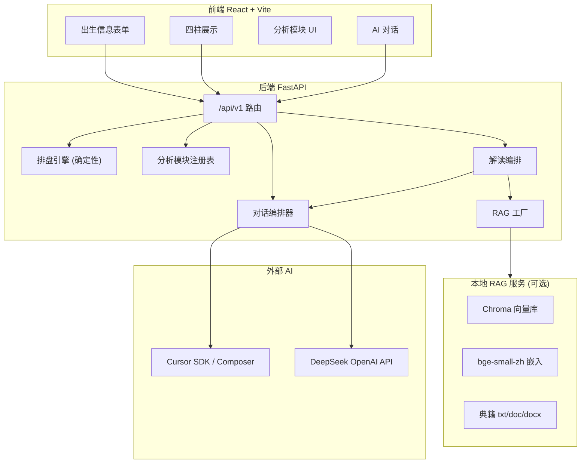
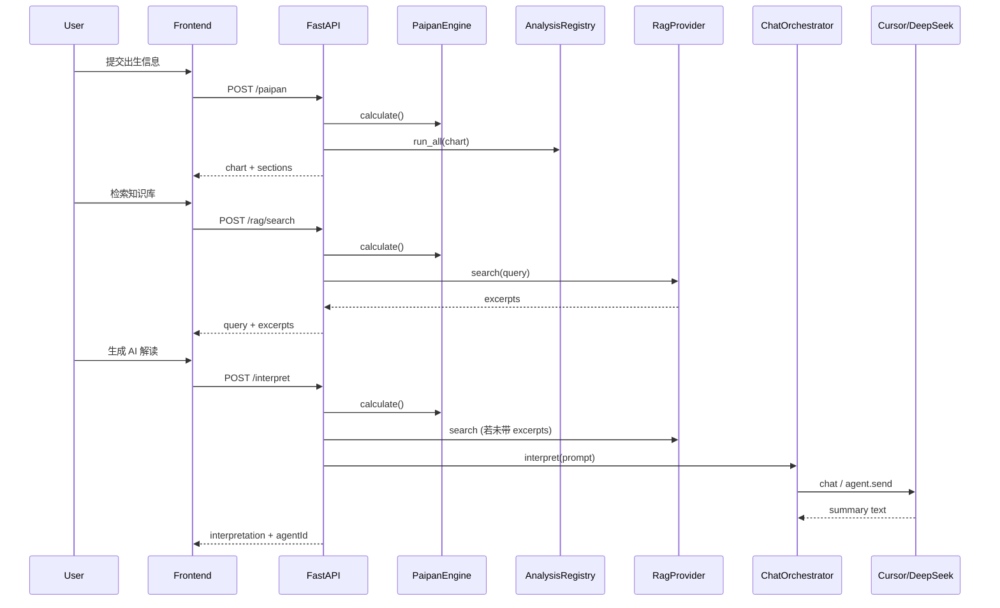

# ZY 八字排盘 Web 平台 - 项目原理说明

> 文档生成日期: 2026-05-27  
> 代码根目录: `d:\ZY\code`

---

## 1. 项目定位

本项目是一个**模块化八字排盘 Web 应用 (MVP)**，核心目标是把「确定性命理计算」与「非确定性 AI / RAG 解读」分层解耦，便于后续扩展：

- 典籍知识库检索 (RAG)
- 可插拔的后端分析模块
- 可插拔的前端展示模块
- 多模型 AI 解读与多轮对话 (Cursor Composer / DeepSeek)

未配置 AI 或 RAG 时，排盘与基础分析仍可独立运行，不影响主流程。

---

## 2. 总体架构

系统由四个相对独立的子系统组成，通过 HTTP API 串联：



**设计原则**

| 层次 | 职责 | 特点 |
|------|------|------|
| 排盘引擎 | 四柱、大运、流年、五行统计 | 纯算法，可复现 |
| 分析模块 | 结构化摘要 (五行、十神、大运等) | 注册表驱动，易扩展 |
| RAG | 从典籍向量库检索摘录 | 可 stub / HTTP 切换 |
| AI | 基于命盘 + 摘录生成解读或对话 | 可选，失败有 fallback |

---

## 3. 目录结构

```
d:\ZY\
  code/
    backend/                 FastAPI 主 API
      app/
        main.py              应用入口、生命周期、CORS
        config.py            环境变量 (BAZI_ 前缀)
        api/router.py        REST 路由聚合
        core/
          paipan/            排盘引擎 (lunar-python)
          analysis/          可注册分析模块
          rag/               RAG 提供者 (stub / http)
          interpret/         检索词与响应组装
          agent/             Cursor + DeepSeek + 会话编排
        schemas/             Pydantic 请求/响应模型
    frontend/                React + TypeScript + Vite
      src/
        App.tsx              主页面状态与流程编排
        components/          UI 组件
        services/            API 调用
        modules/             分析区块 React 组件
        registry/            前端模块注册表
    rag/                     独立本地 RAG 微服务
      build_index.py         从典籍建 Chroma 索引
      server.py              POST /search 检索
      data/chroma/           向量库持久化
  数据库/八字/               典籍源文件 (RAG 索引输入)
  report/                    项目文档 (本文件)
```

---

## 4. 核心业务流程

### 4.1 排盘 (确定性主路径)

**触发**: 用户提交出生信息 -> `POST /api/v1/paipan`

**流程**:

1. `PaipanRequest` 校验历法类型 (solar / lunar)、性别、时辰等
2. `PaipanEngine.calculate()` 调用 `lunar-python`:
   - `resolve_solar_lunar()` 统一为公历/农历 Solar、Lunar
   - `EightChar` 计算年/月/日/时四柱、藏干、十神、纳音
   - `_build_dayun()` 计算大运起运与顺逆
3. `AnalysisRegistry.run_all(chart)` 并行跑已注册分析模块
4. 返回 `PaipanResponse`: `chart` + `sections` + `modules`

**默认规则** (可通过 `BAZI_PAIPAN_SECT` 等环境变量调整):

- 换月: 节气
- 子时 sect=2 (0 点换日)
- 大运: 按性别与年干阴阳定顺逆

大运流年时间轴为**按需加载**: `POST /api/v1/paipan/luck-timeline`，避免首屏阻塞。

### 4.2 典籍检索 (RAG)

**触发**: 前端「检索知识库」-> `POST /api/v1/rag/search`

**流程**:

1. 用当前命盘重新排盘 (与 interpret 共用 `_chart_from_request`)
2. `InterpretService.build_query(chart)` 生成检索词，例如:
   - 日主、月柱、月干十神 -> 格局/用神/调候相关表述
3. `build_rag_provider()` 选择实现:
   - `stub`: 演示数据，无真实检索
   - `http`: 请求 `BAZI_RAG_HTTP_URL/search` (默认指向本地 `code/rag` 服务端口 8100)
4. 返回 `query` + `excerpts[]` (source, excerpt, score)

**本地 RAG 服务原理** (`code/rag/`):

1. `build_index.py` 扫描 `数据库/八字/` 下 txt/doc/docx (排除 pdf 与 `ocr/`)
2. `chunker.py` 分块 (默认 400 字, overlap 80)
3. Chroma + `BAAI/bge-small-zh-v1.5` 向量化持久化到 `data/chroma`
4. `server.py` 对外 `POST /search`，余弦相似度返回 topK 片段
5. **逐文件写入索引**: 每处理完一个文件即写入 Chroma，中断后可续跑 `--no-reset`

**当前典籍目录** (2026-05-27):

| 子目录 | 内容 |
|--------|------|
| `1/` | 三命通会、渊海子平、穷通宝鉴、滴天髓等 |
| `2.蔡昔琼/` | 十干精粹、玄关一窍、月谈赋等 |
| `3.自在道人新派/` | 新派命理精髓、实战命例 |
| `4.曲炜/` | 四柱详批、论八字、六爻详真等 |

索引规模约 **133 文件 / 9310 分块** (见 `code/rag/data/index_report.json`)。嵌入模型固定 ~130MB; 索引体积随分块增长 (~12KB/块)。

**入库工作流**: 见项目 Skill `.cursor/skills/bazi-knowledge-base/SKILL.md` -- 放文件 -> 停 8100 -> `build-index.bat` -> 启 RAG。

### 4.3 AI 解读

**触发**: 前端「生成 AI 解读」-> `POST /api/v1/interpret`

**流程**:

1. 排盘 + 分析模块 -> 完整 `chart`
2. 若请求体未带 `excerpts`，则自动 RAG 检索
3. `build_interpret_prompt(chart, excerpts)` 组装系统提示:
   - 命主、四柱、分析模块 JSON、典籍摘录
   - 要求: 格局、体用、用神喜忌，约 300 字
4. `ChatOrchestrator.interpret(prompt)`:
   - DeepSeek: 单次 chat，创建 session 并写入 bootstrap
   - Cursor: `create` agent + `send` 一次性解读
5. 成功则 `session_store.bind(chart_key, agent_id)`，便于后续对话接续同盘
6. 失败则 `InterpretService._fallback_summary()` 演示文案，不中断接口

### 4.4 AI 多轮对话

**初始化**: `POST /api/v1/chat/init`

- 传入已排盘 `chart` + `sections`
- 创建内存 `session_id` (UUID)
- `set_bootstrap(build_chat_init_prompt)` 注入命盘背景
- 返回 `agentId` (= session_id，非 Cursor 原生 agent id)

**发送消息**:

- 非流式: `POST /api/v1/chat/send`
- 流式 SSE: `POST /api/v1/chat/stream`，事件类型 `delta` / `done` / `error`

**ChatOrchestrator 双通道**:

| 提供商 | 会话实现 | 上下文保持 |
|--------|----------|------------|
| DeepSeek | OpenAI 兼容 API | 内存 history + system bootstrap |
| Cursor | SDK AsyncClient + bridge | 懒创建 Cursor agent_id，首条带 bootstrap |

模型选择: 请求体 `model` 字段，经 `model_by_id` 解析；默认优先 `deepseek-chat`，其次 `composer-2.5`。

跨模型切换时，`foreign_history_prefix` 会把另一模型的对话摘要拼进 Cursor 消息，减少上下文丢失。

---

## 5. 后端模块详解

### 5.1 应用生命周期 (`app/main.py`)

启动时 (`lifespan`):

1. `init_agent_service` - Cursor API Key / model / workspace / runtime
2. `init_deepseek_client` - DeepSeek Key
3. `init_chat_orchestrator` - 绑定上述服务 + `AgentSessionStore`
4. `agent_service.startup()` - Cursor bridge 按需懒启动

关闭时 `agent_service.shutdown()` 释放 bridge。

CORS 允许本地 5173 及 `*.tcloudbaseapp.com` (云托管前端)。

### 5.2 排盘引擎 (`core/paipan/`)

| 文件 | 作用 |
|------|------|
| `engine.py` | 主计算器 `PaipanEngine` |
| `calendar.py` | 公历/农历输入归一 |
| `rules.py` | sect、早子时等规则 |
| `detail_builder.py` | 柱位详细结构 |
| `luck_builder.py` | 大运流年时间轴、流日 |
| `models.py` | `PaipanInput` / `PaipanResult` 数据类 |

**关键约束**: 命理数值逻辑只放在 paipan 层，禁止放入 RAG 或 AI 层，保证可测试与可复现。

### 5.3 分析模块 (`core/analysis/`)

- 基类 `AnalysisModule`: `id`, `name`, `order`, `analyze(chart)`, `to_section()`
- 默认注册 (`registry.build_default_registry`):
  - `summary` - 综合摘要
  - `wuxing` - 五行强弱
  - `shishen` - 十神关系
  - `dayun` - 大运概览

扩展: 新建 `modules/xxx.py` 并在 `build_default_registry()` 中 `register()`。

### 5.4 Agent 子系统 (`core/agent/`)

| 组件 | 职责 |
|------|------|
| `service.CursorAgentService` | Cursor SDK bridge、create/resume agent、interpret/send |
| `deepseek.DeepSeekClient` | OpenAI 兼容 chat / stream |
| `chat_orchestrator.ChatOrchestrator` | 统一入口，路由到 Cursor 或 DeepSeek |
| `session_store.AgentSessionStore` | 内存: bootstrap、消息历史、chart->session、cursor agent 映射 |
| `prompts.py` | 命盘上下文与解读/对话 prompt 模板 |
| `models.py` | 可选模型列表与启用过滤 |

**Runtime 解析** (`resolve_runtime`):

- 显式 `local` / `cloud`
- 或环境变量 `BAZI_CURSOR_RUNTIME=cloud`
- 或存在 `PORT` (容器) 时自动 cloud

Cloud 模式下 agent 会话重启后不可 resume，会报错；本地模式可 `resume(agent_id)`。

### 5.5 API 路由一览 (`api/router.py`)

| 方法 | 路径 | 说明 |
|------|------|------|
| GET | `/api/v1/health` | 健康检查 |
| GET | `/api/v1/modules` | 分析模块列表 |
| POST | `/api/v1/paipan` | 排盘 + 分析 |
| POST | `/api/v1/paipan/luck-timeline` | 大运流年时间轴 |
| GET | `/api/v1/liuri/{year}` | 流日 (按年、日主) |
| POST | `/api/v1/rag/search` | 仅 RAG 检索 |
| POST | `/api/v1/interpret` | 排盘 + RAG + AI 解读 |
| GET | `/api/v1/chat/status` | AI 可用性与模型列表 |
| POST | `/api/v1/chat/init` | 初始化对话会话 |
| POST | `/api/v1/chat/send` | 非流式对话 |
| POST | `/api/v1/chat/stream` | SSE 流式对话 |

---

## 6. 前端原理

### 6.1 页面状态机 (`App.tsx`)

主视图 `appView`: `summary` | `pillars` | `luck` | `chat`

典型用户路径:

1. `handleSubmit` -> `fetchPaipan` 仅排盘 (不自动 RAG/AI)
2. 用户点击「检索知识库」-> `fetchRagSearch`
3. 用户点击「生成 AI 解读」-> `fetchInterpret` (可复用已有 excerpts)
4. 用户进入「AI 对话」-> `initChatSession` 或自动连接
5. 查看柱详 / 大运流年 -> 懒加载 `fetchLuckTimeline`

**刻意拆分**: 排盘与 RAG/AI 分离，避免 Cursor bridge 或 RAG 慢请求阻塞首屏。

### 6.2 API 层

- `services/api.ts` - 排盘、解读、RAG、大运
- `services/chatApi.ts` - chat status/init/send/stream (SSE 解析)
- `services/config.ts` - `API_BASE` 指向后端

### 6.3 模块化 UI

`registry/sectionRegistry.ts` 与后端 `AnalysisRegistry` 对应:

- 按 `section.id` 映射 React 组件 (`SummarySection`, `WuxingSection` 等)
- `registerSectionModule()` 可扩展新 UI 块而无需改 `App.tsx` 布局

---

## 7. 配置与环境变量

所有后端配置使用 `BAZI_` 前缀 (`app/config.py` + `.env`):

| 变量 | 默认值 | 含义 |
|------|--------|------|
| `BAZI_PAIPAN_SECT` | 2 | 子时换日 sect |
| `BAZI_RAG_PROVIDER` | stub | stub 或 http |
| `BAZI_RAG_HTTP_URL` | (空) | RAG 服务地址，如 http://127.0.0.1:8100 |
| `BAZI_CURSOR_API_KEY` | (空) | Cursor Integrations API Key |
| `BAZI_CURSOR_MODEL` | composer-2.5 | Cursor 模型 |
| `BAZI_CURSOR_WORKSPACE` | backend 根目录 | local runtime 工作区 |
| `BAZI_CURSOR_RUNTIME` | auto | local / cloud / auto |
| `BAZI_DEEPSEEK_API_KEY` | (空) | DeepSeek API Key |
| `BAZI_DEEPSEEK_BASE_URL` | https://api.deepseek.com | DeepSeek 端点 |
| `BAZI_STATS_DB_PATH` | (空, 本地默认 `backend/data/usage_stats.db`) | 累计访客 SQLite 路径 |
| `BAZI_MEIHUA_RAG_CATEGORY` | 03梅花易学 | 梅花 RAG 分类 |
| `BAZI_QIMEN_RAG_CATEGORY` | 04奇门遁甲 | 奇门 RAG 分类 |
| `BAZI_LIUYAO_RAG_CATEGORY` | 02六爻卜筮 | 六爻 RAG 分类 |

参考模板: `code/backend/.env.example`

---

## 8. 部署与运行

### 8.1 本地开发 (Windows)

- 一键: `code/start-all.bat` (RAG 8100 + 后端 8000 + 前端 5173)
- 或分别: `start-backend.bat`, `start-frontend.bat` (preview 模式)
- RAG 单独: `code/rag/start-rag.bat` (8100); 新增典籍后运行 `code/rag/build-index.bat` (需 Python 3.10, 重建前停 8100)

### 8.2 容器

`code/backend/Dockerfile`:

- Python 3.11-slim
- 监听 `0.0.0.0:8080`
- `PORT=8080` 触发 Cursor cloud runtime
- 默认 `BAZI_STATS_DB_PATH=/mnt/data/usage_stats.db` (需配合云托管存储挂载)

**云上累计访客持久化**: 累计人数存 SQLite; 容器内 `/app/data` 在重新部署后会丢失。请在 CloudBase 云托管控制台为服务启用 **存储挂载** (对象存储 COS), 实例挂载路径 `/mnt`, 对象存储子路径如 `stats/`; 环境变量 `BAZI_STATS_DB_PATH=/mnt/data/usage_stats.db` (镜像已预设)。重新发版后累计访客会保留; **当前在线** 仍为进程内存计数, 重启后会短暂归零再随心跳恢复。

前端可构建静态资源部署到 CloudBase 静态托管; CORS 已预留 `*.tcloudbaseapp.com`。

### 8.3 依赖

**后端** (`requirements.txt`): FastAPI, lunar-python, cursor-sdk, httpx, pydantic-settings 等

**RAG** (`code/rag/requirements.txt`): chromadb, sentence-transformers, fastapi, uvicorn

**前端**: React 18, Vite, TypeScript

---

## 9. 数据流时序 (完整解读一次)



---

## 10. 扩展指南 (与 README 一致)

### 后端新增分析模块

1. 在 `backend/app/core/analysis/modules/` 新建模块类
2. 继承 `AnalysisModule`, 实现 `analyze()`
3. 在 `registry.build_default_registry()` 中 `register()`

### 前端新增展示模块

1. 在 `frontend/src/modules/` 新建组件
2. 在 `sectionRegistry.ts` 中 `registerSectionModule()`

### 接入真实典籍 RAG

1. 将典籍放入 `数据库/八字/`
2. 运行 `code/rag/build-index.bat`
3. 启动 `code/rag/start-rag.bat`
4. 设置 `BAZI_RAG_PROVIDER=http` 与 `BAZI_RAG_HTTP_URL=http://127.0.0.1:8100`

### 接入 AI

- Cursor: `BAZI_CURSOR_API_KEY` + 可选 `BAZI_CURSOR_MODEL`
- DeepSeek: `BAZI_DEEPSEEK_API_KEY`
- 至少配置其一; `GET /api/v1/chat/status` 可检查启用状态

---

## 11. 已知限制与注意事项

1. **会话存储为进程内内存**: 后端重启后 `agentId` / 对话历史丢失; Cloud Cursor agent 同样不可跨重启 resume。
2. **RAG 与后端分离进程**: 生产需保证 RAG 服务可达或回退 stub。
3. **排盘与 AI 解耦**: 无 API Key 时 interpret 返回 fallback 摘要，前端显示「演示模式」。
4. **首条 Cursor 对话**: bootstrap 仅在首次 send 注入，后续追问靠 agent 会话或 history 前缀。
5. **典籍路径**: RAG 索引源为仓库根下 `数据库/` 十类子目录, 与 `code/rag/categories.py` 一致; 六爻检索使用 `02六爻卜筮` collection.
6. **入库期间**: 仅 RAG (8100) 与依赖检索的 interpret/rag/search 暂不可用; 排盘、改代码、前后端开发不受影响。
7. **个别 doc 可能入库失败**: 需本机 Word/WPS; 损坏文件见 `index_report.json` 中 `error` 项。

---

## 12. 相关文件索引

| 主题 | 关键路径 |
|------|----------|
| 入口 | `code/backend/app/main.py` |
| 路由 | `code/backend/app/api/router.py` |
| 排盘 | `code/backend/app/core/paipan/engine.py` |
| 分析注册 | `code/backend/app/core/analysis/registry.py` |
| RAG 工厂 | `code/backend/app/core/rag/factory.py` |
| 解读编排 | `code/backend/app/core/interpret/service.py` |
| AI 编排 | `code/backend/app/core/agent/chat_orchestrator.py` |
| Prompt | `code/backend/app/core/agent/prompts.py` |
| 前端主流程 | `code/frontend/src/AppShell.tsx`, `code/frontend/src/tabs/` |
| 六爻排盘 | `code/backend/app/core/liuyao/engine.py` |
| 六爻 API | `code/backend/app/api/liuyao_router.py` |
| 六爻 Prompt | `code/backend/app/core/agent/prompts_liuyao.py` |
| RAG 服务 | `code/rag/server.py`, `code/rag/build_index.py` |
| 入库 Skill | `.cursor/skills/bazi-knowledge-base/SKILL.md` |
| 索引报告 | `code/rag/data/index_report.json` |
| 使用说明 | `code/README.md` |

---

## 13. 六爻卜筮 MVP (2026-05-27)

### 13.1 前端 Ten Tab

- `AppShell.tsx` 顶部十类术数 Tab; 当前 **八字** 与 **六爻** 可用, 其余 8 类显示占位页.
- 八字 Tab 为原 `BaziTab.tsx`; 六爻 Tab 为 `LiuyaoTab.tsx`.

### 13.2 六爻 API

| 方法 | 路径 | 说明 |
|------|------|------|
| POST | `/api/v1/liuyao/divine` | 起卦并排盘 (摇卦/数字/时间) |
| POST | `/api/v1/liuyao/infer-yong-shen` | AI 推断用神 JSON |
| POST | `/api/v1/liuyao/yong-shen` | 用户手动改用神 |
| POST | `/api/v1/liuyao/rag/search` | 按卦名+用神+动爻+问事检索 |
| POST | `/api/v1/liuyao/interpret` | 用神 + RAG + AI 解读 |
| POST | `/api/v1/liuyao/chat/init` | 六爻对话 bootstrap |

### 13.3 规则

- 装卦/六神/月建: 《卜筮正宗》京房纳甲体系; 解盘 prompt 倾向《增删卜易》.
- 摇卦: 三钱六次, 三背老阳, 三字老阴; 动爻生变卦.
- 数字: 梅花 1/2/3 数起卦后转纳甲.
- 时间: 农历取数, 月建按节气.
- RAG category: `BAZI_LIUYAO_RAG_CATEGORY=02六爻卜筮` (默认).

---

## 14. 梅花易学 MVP

### 14.1 前端

- Tab `03` 梅花易学: `MeihuaTab.tsx` (数字/时间起卦, 体用面板, 无纳甲用神).
- 组件: `MeihuaBoard`, `TiYongPanel`.

### 14.2 API

| 方法 | 路径 | 说明 |
|------|------|------|
| POST | `/api/v1/meihua/divine` | 起卦 + 体用 + 互卦 |
| POST | `/api/v1/meihua/ti-yong` | 静卦时指定动爻位重算体用 |
| POST | `/api/v1/meihua/rag/search` | RAG `03梅花易学` |
| POST | `/api/v1/meihua/interpret` | 结构化节点 + RAG + AI |
| POST | `/api/v1/meihua/chat/init` | 梅花对话 bootstrap |

### 14.3 体用规则

- 有动爻: 动爻所在卦为用, 另一卦为体.
- 无动爻: 下卦体, 上卦用; 可 POST `/ti-yong` 指定动爻位.
- 起卦: 邵雍数字/时间 (复用 `liuyao.casting` 梅花分支, 不装纳甲).

### 14.4 结构化知识

- 节点文件: `code/knowledge/data/graph/meihua_nodes.jsonl` (topic: `gua`, `ti_yong`, `leixiang`).
- 生成: `python code/knowledge/scripts/seed_meihua_nodes.py`.
- RAG: `BAZI_MEIHUA_RAG_CATEGORY=03梅花易学`.

## 15. 奇门遁甲 MVP

### 15.1 产品边界

- 独立起局: 仅以起局时刻排盘, 不引用用户八字.
- AI 可选: `birthProfile` 仅注入解读/对话 prompt, 不参与起局计算.
- 默认拆补法 (`method=chaibu`), 可选置闰 (`zhirun`); 茅山转盘占位.
- 输入: 事占/行占、方位、真太阳时(经度)、调试局数 `juOverride` 1-9.
- 输出: 九宫 (地/天/人盘干 + 八门九星八神) + 值符值使 + 四柱 + 节气局名.

### 15.2 API

| 方法 | 路径 | 说明 |
|------|------|------|
| GET | `/api/v1/qimen/methods` | 排盘法列表 |
| POST | `/api/v1/qimen/chart` | 起局并排盘 |
| POST | `/api/v1/qimen/rag/search` | RAG `04奇门遁甲` |
| POST | `/api/v1/qimen/interpret` | 结构化节点 + RAG + AI |
| POST | `/api/v1/qimen/chat/init` | 奇门对话 bootstrap |

### 15.3 实现要点

- 引擎: `app/core/qimen/` (vendored kinqimen 拆补/置闰 + `adapter` 真太阳时与人盘).
- 依赖: `sxtwl`, `ephem` (vendor 节气干支).
- 节点: `qimen_nodes.jsonl` (topic: `ju`, `men`, `xing`, `shen`, `yong`).
- 生成: `python code/knowledge/scripts/seed_qimen_nodes.py`.
- 法窍抽取: `python code/knowledge/scripts/extract_qimen_from_faqiao.py --merge` (GBK 源文, 八门九星/八神/节序).
- 茅山: `method=maoshan`, 节气交节起上元, 每节 60 时辰换元, 转盘排盘同拆补.
- 前端: `QimenTab` + `QimenGrid` 九宫展示; 勾选「AI 参考八字」需先在八字 Tab 排盘 (sessionStorage).

## 16. 大六壬 MVP

### 16.1 产品边界

- 正六壬 (月将加时、九宗门) + 金口诀 (`castMethod`: liuren | jinkou | both).
- 占时四柱起课, 不引用用户本命八字.
- 真太阳时、公历/农历; 可选金口诀地分、贵人昼夜.
- 输出: 四课、三传、天地盘、天将、课体、神煞; 金口诀人元/贵神/将神/地分.

### 16.2 API

| 方法 | 路径 | 说明 |
|------|------|------|
| GET | `/api/v1/liuren/methods` | 起课法列表 |
| POST | `/api/v1/liuren/chart` | 起课 |
| POST | `/api/v1/liuren/rag/search` | RAG `05大六壬` |
| POST | `/api/v1/liuren/interpret` | 结构化节点 + RAG + AI |
| POST | `/api/v1/liuren/chat/init` | 六壬对话 bootstrap |

### 16.3 实现要点

- 引擎: `app/core/liuren/` (vendored kinliuren + `calendar_bridge` + `shensha`).
- 节点: `liuren_nodes.jsonl` (topic: yue_jiang, tian_jiang, yong, jinkou 等).
- 生成: `py code/knowledge/scripts/seed_liuren_nodes.py`.
- 指南抽取: `py code/knowledge/scripts/extract_liuren_from_zhinan.py --merge` (心印赋/指掌赋 + 课体采集 + 神煞词条).
- 上线清单: `code/docs/DEPLOY_LIUREN.md`.
- 前端: `LiurenTab` Tab `05` 已启用; 奇门/六壬表单支持公历农历与闰月.

## 17. 紫微斗数 MVP (Tab 11)

### 17.1 产品边界

- 南派三合安星 (引擎 `iztro-py`), 规则独立于八字 `PaipanRules`.
- 出生信息与八字共用 `SavedProfiles`; 术数选项分 `baziSettings` / `ziweiSettings`.
- 默认真太阳时 (经度 120); 可关; 闰月/子时/四化表可配置 (北派四化预留).
- 输出: 十二宫、局数、命主身主、大限列表、小限表、流年 (可改参照年).

### 17.2 API

| 方法 | 路径 | 说明 |
|------|------|------|
| GET | `/api/v1/ziwei/rules` | 规则枚举 |
| POST | `/api/v1/ziwei/chart` | 排盘 + 运限 |
| POST | `/api/v1/ziwei/rag/search` | RAG `11紫微斗数` |
| POST | `/api/v1/ziwei/interpret` | RAG + AI |
| POST | `/api/v1/ziwei/chat/init` | 紫微对话 bootstrap |

### 17.3 实现要点

- 引擎: `app/core/ziwei/` (`calendar_bridge`, `vendor/iztro_adapter`, `normalize`).
- 文档: `code/backend/docs/ziwei-mvp.md`.
- 前端: `ZiweiTab` + `ZiweiPalaceGrid` + `ZiweiLimitsPanel`.

---

*本文档根据当前仓库代码梳理，若实现变更请以代码为准。*
